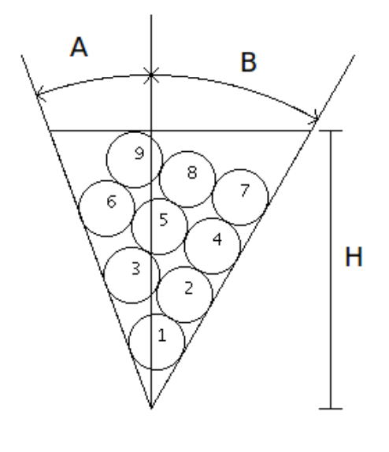

## 문제

For her next project, Beebe Flat wishes to paint a bowl of fruit. Naturally, the bowl is two-dimensional, as is all of the fruit. She bought a triangular bowl which somehow always manages to stay upright, with a perfectly level top. The bowl has a height H, and opens A degrees to the left and B degrees to the right (see diagram). In the interest of art, Beebe eschews symmetry, so A ≠ B. She plans to buy perfectly circular fruit, each with radius 1, to put into the bowl. However, perfectly circular fruit is expensive, so she needs your help to figure out how much fruit she has to buy. She plans to fill the bowl to the brim, adding as much fruit as possible without any part exceeding the height of the bowl. Thankfully, she is not interested in an optimal packing, since she wants a simple algorithm for actually arranging the fruit. She will place the fruit one at a time, each time choosing the lowest possible location for the center.

Since Beebe doesn’t like to deal with ties, she always purchases a bowl such that there is only one lowest possible location within a margin of 10−5. Finally, to ensure that a lid will fit nicely on the bowl when she’s done painting, she only chooses bowls such that, when properly packed, the last piece of fruit to fit will be at least 10−2 below the top, and the next piece of fruit that would fit if the bowl were taller will jut out at least 10−2 above the top.

Given a particular bowl, how many pieces of fruit does Beebe need to buy to fill the bowl in this manner?

## 입력

The input consists of multiple test cases. Each test case has three integers on a single line, denoting A, B, and H. 1 ≤ A, B ≤ 45, A ≠ B, and 1 ≤ H ≤ 300. The last test case will be followed by A = B = H = 0, which should not be processed.

## 출력

For each test case, print on a single line the number of pieces of fruit that Beebe needs to buy to fill the given bowl.
