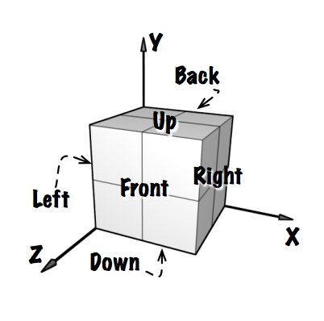
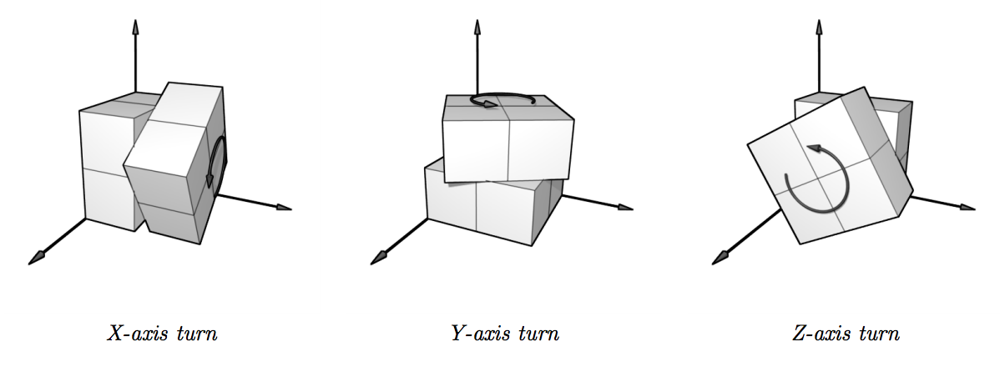

## 문제

Sonny is probably the only computer science Ph.D. student who cannot solve a Rubik’s cube. One day, he came across a neat little 2 × 2 × 2 Rubik’s cube, and thought, “Finally, here’s a cube that’s easy enough for me to do!” Nope, wrong! He got pwned, hardcore. How embarrassing.

To ensure that this does not happen again, he decides to write a computer program to solve the cube. Then he had this brilliant idea: Why not have the students at the programming contest do the work instead? So, given an initial configuration of the 2×2×2 Rubik’s cube, your task for this problem is to write a program that solves it.

The mini-cube has 6 faces, each with 4 painted tiles on it. The faces are labeled Front (F), Back (B), Up (U), Down (D), Left (L), and Right (R), according to the diagram below. Each of the tiles on the faces can be colored Red (R), Green (G), Blue (B), Yellow (Y), Orange (O), or White (W), and there are exactly 4 instances of each color. The cube is considered solved when the colors of all tiles on each distinct face of the cube match.



You may use any combination of three distinct moves to transform the cube: a turn about the X-axis, a turn about the Y-axis, or a turn about the Z-axis. Each turn is exactly 90 degrees of all tiles on half the cube, in the directions illustrated below. Note that the back-down-left corner is fixed with respect to all valid transforms.



Can you come up with a sequence of moves that will solve a given configuration of the Rubik’s cube?

## 입력

You will be given maps of an “unwrapped” cubes showing colors on each of the faces, in the following format:

```

..UU....
..UU....
LLFFRRBB
LLFFRRBB
..DD....
..DD....
```

The letters in the above diagram shows you where to find the colors on each face (as shown in the first diagram) from the map only – it is not valid input! The front face is oriented as in the diagram, with the other faces on the map attached to it so that it wraps to cover the cube. The letters on the faces may be any of R, G, B, Y, O, or W to indicate the color. Dot (.) characters serve to pad the map to a 6 × 8 grid, and are of no other significance.

The input consists of several configuration maps in the format described, separated by blank lines. You may assume that each configuration is both valid and solvable. The end of input is denoted by an “empty” configuration consisting solely of ‘.’ characters; do not process this map.

## 출력

For each cube, output on a single line a sequence of moves that will solve the cube. Output ‘X’ for a turn about the X-axis, ‘Y’ for a turn about the Y-axis, and ‘Z’ for a turn about the Z-axis. Any sequence of moves (that is reasonably finite) which solves the given configuration will do. (After all, Sonny does need to execute your commands to verify that your program works!) A blank line will suffice for an input cube that is already solved.

Note that the time limit for this problem is more generous than others, and one of the more difficult configurations is provided in the sample.
