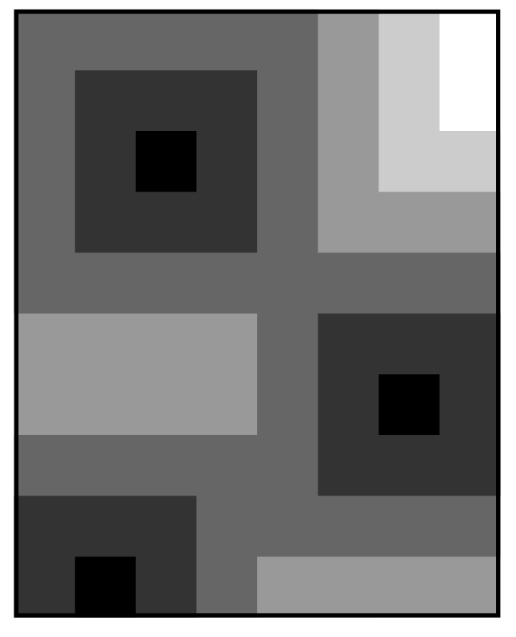

## 문제

Remember the painter Peer from the 2008 ACM ICPC World Finals? Peer was one of the inventors of monochromy, which means that each of his paintings has a single color, but in different shades. He also believed in the use of simple geometric forms.

Several months ago, Peer was painting triangles on a canvas from the outside in. Now that triangles are out and squares are in, his newest paintings use concentric squares, and are created from the inside out! Peer starts painting on a rectangular canvas divided into a perfect square grid. He selects a number of single grid cells to act as central seeds, and paints them with the darkest shade. From each of the seed squares, Peer paints a larger square using a lighter shade to enclose it, and repeats with larger squares to enclose those, until the entire canvas is covered. Each square is exactly one grid cell larger and one shade lighter than the one it encloses. When squares overlap, the grid cell is always filled using the darker shade.

Figure 1: Example of one of Peer’s most recent works using six shades of color.

After Peer decides where to place the initial squares, the only difficult part in creating these paintings is to decide how many different shades of the color he will need. To help Peer, you must write a program that computes the number of shades required for such a painting, given the size of the canvas and the locations of the seed squares.

## 입력

The input test file will contain multiple cases. Each test case begins with a single line containing three integers, m, n, and s, separated by spaces. The canvas contains exactly m × n grid cells (1 ≤ m,n ≤ 1000), numbered 1,... ,m vertically and 1,... ,n horizontally. Peer starts the painting with s (1 ≤ s ≤ 1000) seed cells, described on the following s lines of text, each with two integers, ri and ci (1 ≤ ri ≤ m, 1 ≤ ci ≤ n), describing the respective grid row and column of each seed square. All seed squares are within the bounds of the canvas.

A blank line separates input test cases, as seen in the sample input below. A single line with the numbers “0 0 0” marks the end of input; do not process this case.

## 출력

For each test case, your program should print one integer on a single line: the number of different shades required for the painting described.
