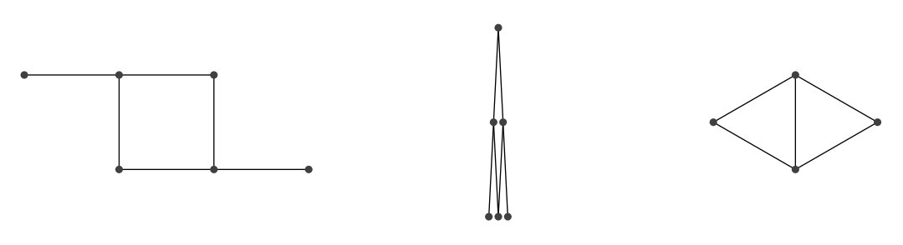

## 문제

You may know of a certain popular and coveted construction toy that Francis got for her birthday this week. This toy consists of a number of metal spheres that can be connected to each other using rigid links (all of the same length) with a magnet on each end. The ends of the links stick to the metal spheres, and the links can freely rotate and extend from the sphere in any direction (essentially forming a spherical joint), allowing you to create a variety of interesting structures.

Francis has assembled several such structures, and now wishes to store her creations by hanging them up in a corner of her room. She notices that, for some of her structures, when she picks it up and holds it by a single sphere, all the links collapse into a single, thin vertical line (see Figure 3) due to the pull of gravity and the spherical joints. Francis can hang up her creations by affixing one sphere on the structure to her ceiling, and wishes to save space by hanging each one up by the sphere that results in the shortest collapsed line. She deems those fixtures which do not hang as a single thin line to take up too much space, and discards them.

Figure 3: One of Francis’s constructions (left), the same collapsed into a straight-line fixture of length 2 (middle), and a structure that will not collapse into a single line when hung up by any sphere (right). Note that in the middle diagram, the horizontal gaps shown between the spheres are for illustrative purposes only! Mathematically, the fixture would be a single, infinitely thin vertical line.

For simplicity, we can treat the metal spheres as infinitely small points and the links as line segments of unit length. Can you write a program to help Francis figure out how much space her fixtures will take, and which ones to discard? Your task is to find the shortest length possible for the collapsed fixture if you were to hang it up by a single sphere, or report that there is no way to hang up the fixture by so that it collapses into an infinitely thin straight line.

## 입력

The input will contain multiple test cases for you to analyze. Each test case describes a fully connected fixture (i.e. there are no loose, unattached components). The first line of a test case consists of two integers, n and m, separated by a space, indicating the number of spheres (1 ≤ n ≤ 100) and links (0 ≤ m ≤ 1000) used in the structure, respectively. The spheres are numbered uniquely from 1 to n. The following m lines of input each contain two integers, ai and bi (1 ≤ ai, bi ≤ n), indicating that Francis has attached sphere a to sphere b in her fixture. Note that both ends of a link cannot be attached to a single sphere, and no two links will attach the same two spheres.

A blank line separates input test cases, as seen in the sample input below. A single line containing “0 0” marks the end of input; do not process this case.

## 출력

For each input test case, print a single line containing the shortest length possible of the collapsed fixture. If it is not possible to hang the described fixture up by a single sphere so that it collapses into a line, print “impossible”.
