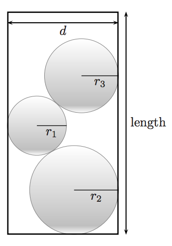

## 문제

Gwen just bought a bag of gumdrops! However, she does not like carrying gumdrops in plastic bags; instead, she wants to pack her gumdrops in a cylindrical tube of diameter d. Given that each of her gumdrops are perfect spheres of radii r1,r2,... ,rn, find the shortest length tube Gwen can use to store her gumdrops.

Figure 4: Gumdrops packed into a cylindrical tube.

You should assume that the gumdrop radii are sufficiently large that no three gumdrops can be simultaneously in contact with each other while fitting in the tube. Given this restriction, it may be helpful to realize that the gumdrops will always be packed in such a way that their centers lie on a single two-dimensional plane containing the axis of rotation of the tube.

## 입력

The input file will contain multiple test cases. Each test case will consist of two lines. The first line of each test case contains an integer n (1 ≤ n ≤ 15) indicating the number of gumdrops Gloria has, and a floating point value d (2.0 ≤ d ≤ 1000.0) indicating the diameter of the cylindrical tube, separated by a space. The second line of each test case contains a sequence of n space-separated floating point numbers, r1 r2 ... rn (1.0 ≤ ri ≤ d/2) are the radii of the gum drops in Gloria’s bag. A blank line separates input test cases. A single line with the numbers “0 0” marks the end of input; do not process this case.

## 출력

For each input test case, print the length of the shortest tube, rounded to the nearest integer.
