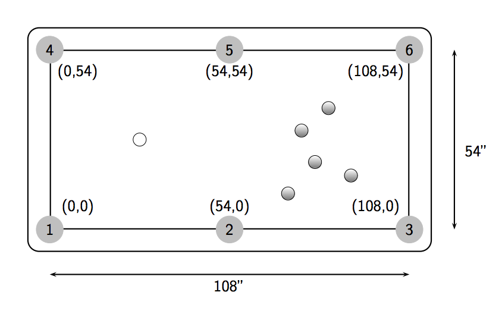
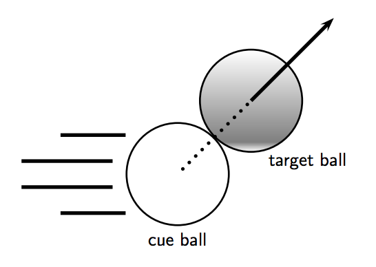

## 문제

Billiards, also commonly known as “pool,” is a popular game in North America. The game is played on a rectangular table with six pockets—one at each corner and one in the middle of each of the two longer sides of the table. The object of the game is to strike a cue ball so that it collides with other balls, knocking them into the pockets.

The surface of our pool table measures 108” by 54”, and to facilitate computation, we place it on the Cartesian plane with its southwest corner situated at (0, 0), and its northeast corner at (108, 54). Therefore, the centers of the 6 pockets, numbered 1 through 6, will have coordinates of (0, 0), (54, 0), (108, 0), (0, 54), (54, 54), and (108, 54), respectively (see Figure 2). The billiard balls are spherical and measure 2” in diameter.

Figure 2: Diagram of pool table.

Given the location of the cue ball, a target ball, and a number of other balls on the table, your task for this problem is to write a program to determine whether or not you can successfully make a particular pool shot. The cue ball can be struck in any direction in a straight line. We consider collisions between the balls to be perfectly elastic, so that the target ball will always travel in a straight line, away from the point on its surface contacted by the cue ball (see Figure 3).2

A shot is considered possible if the cue ball can be struck so that it collides directly with the target ball, in turn sending the target ball directly into a pocket. Neither ball should collide with any other balls, bounce off the edges of the table (cushions), nor should their centers cross the boundaries of the table. In other words, you are not to consider any bank shots, combination shots, spin shots, or any other trick shots in this problem. Note that the difference between the incoming angle of the cue ball and the outgoing angle of the target ball must be greater than 90◦ . The target ball is considered to land in a pocket when its center coincides with the center of that pocket.

Figure 3: Diagram of pool ball collision.

2You may assume that the cue ball disappears immediately after making contact with the target ball.

## 입력

The input test file will contain multiple cases. The first line of each test case contains four real numbers, xc yc xt yt, where (xc, yc) is the location of the cue ball and (xt, yt) is the location of the target ball. The second line of the test case contains an integer n (where 0 ≤ n ≤ 14), the number of additional balls on the table, followed by n pairs of real numbers, x1 y1 . . . xn yn, where (xi , yi) is the location of the ith additional (possibly obstructing) ball. No two balls overlap, and all balls are strictly in the interior of the table; in particular, all provided coordinates obey 3 < x < 105 and 3 < y < 51.

Input is terminated with a single line containing only the number 0; do not process this line.

## 출력

For each test case, output on a single line the number(s) of the pocket(s) into which the target ball can be shot, sorted in ascending numerical order. Separate pocket numbers with a single space. If there are no pockets for which a clear shot exists, output the words “no shot”.
