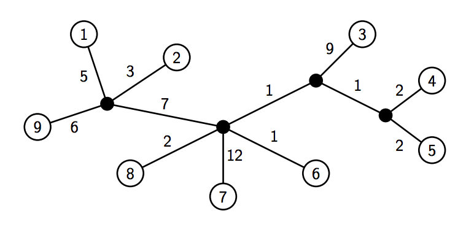

## 문제

Every morning, Joe the Jogger goes for a brisk run around his neighborhood. The houses in the neighborhood (which are numbered from 1 to n) are connected together by a set of roads with the property that between every two houses, there exists exactly one unique path. That is, the graph structure of the road network is a tree of unknown topology, consisting of n leaf nodes (corresponding to each of the houses) and up to n−1 (but possibly fewer) internal nodes denoting intersections where roads split or merge (see Figure 4).

In this problem, your task is to help Joe plan a jogging route from one house in the neighborhood to another house. Because Joe is a veteran jogger, he wants his route to take as long as possible. Given a matrix of distances (in meters) between each pair of houses along the road graph, the number of seconds r it takes Joe to run one meter, and the number of seconds t it takes for Joe to cross each intersection along the route, determine the pair of houses for which the total travel time is as long as possible.

Figure 4: Diagram of neighborhood with n = 9. Houses correspond to numbered nodes, whereas internal nodes of the tree (i.e., intersections) correspond to filled nodes. Note that multiple roads may meet at a single intersection. Here, d3,9 = 9 + 1 + 7 + 6 = 23. If r = 1 and t = 5, then running from house 3 to house 9 takes Joe 1 × 23 + 3 × 5 = 38 seconds. In the neighborhood shown above, this is the longest possible route, timewise, that Joe can take.

## 입력

The input test file will contain multiple cases. Each test case begins with a line containing three integers: n (where 1 ≤ n ≤ 50), the total number of houses in the neighborhood, r (where 1 ≤ r ≤ 10), the number of seconds per meter traveled, and t (where 1 ≤ t ≤ 100), the number of seconds needed to cross each intersection. Then, the next n lines each contain n values indicating the distances dij (where 1 ≤ dij ≤ 1000) between each pair of houses. The distances are specified in row-major order; i.e., the jth entry of the ith line is dij.

You are guaranteed that dii = 0 for each i and that dij = dji for i ≠ j. Furthermore, you may assume that the distance matrix corresponds to path lengths along some valid tree, no house coincides with any internal node of the tree, each internal node of the tree has degree ≥ 3, and all edges in the tree have positive length. Input is terminated by a single line containing the number 0; do not process this line.

## 출력

For each test case, you must print a single line of output containing the longest total travel time possible.
