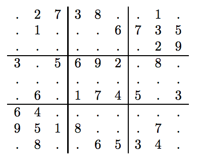

## 문제

In the game of Sudoku, you are given a large 9 × 9 grid divided into smaller 3 × 3 subgrids. For example,

Given some of the numbers in the grid, your goal is to determine the remaining numbers such that the numbers 1 through 9 appear exactly once in (1) each of nine 3 × 3 subgrids, (2) each of the nine rows, and (3) each of the nine columns.

## 입력

The input test file will contain multiple cases. Each test case consists of a single line containing 81 characters, which represent the 81 squares of the Sudoku grid, given one row at a time. Each character is either a digit (from 1 to 9) or a period (used to indicate an unfilled square). You may assume that each puzzle in the input will have exactly one solution. The end-of-file is denoted by a single line containing the word “end”.

## 출력

For each test case, print a line representing the completed Sudoku puzzle.
