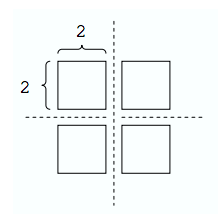
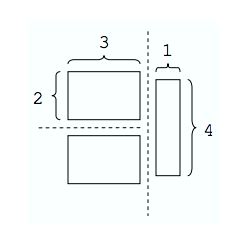

## 문제

You are given a rectangular cake of integral dimensions w × h. Your goal is to divide this cake into m rectangular pieces of integral dimensions such that the area of the largest piece is minimal. Each cut must be a straight line parallel to one of the sides of the original cake and must divide a piece of cake into two new pieces of positive area. Note that since a cut divides only a single piece, exactly m − 1 cuts are needed.

## 입력

The input test file will contain multiple test cases, each of which consists of three integers w, h, m separated by a single space, with 1 ≤ w, h, m ≤ 20 and m ≤ wh. The end-of-file is marked by a test case with w = h = m = 0 and should not be processed.

## 출력

For each test case, write a single line with a positive integer indicating the area of the largest piece.

## 힌트

If w = 4, h = 4, and m = 4, then the following cuts minimize the area of the largest piece:

However, if w = 4, h = 4, and m = 3, then the following cuts are optimal:

