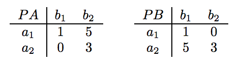

## 문제

A two-player normal form game between two individuals A and B is completely specified by

* {a1, . . . , am}, a set of actions for player A,
* {b1, . . . , bn}, a set of actions for player B,
* PA, an m × n payoff matrix for player A, and
* PB, an m × n payoff matrix for player B.

In such a game, both players simultaneously select actions to be played (say ai and bj for players A and B, respectively). Then payoffs for each player are determined according to the payoff matrices (PA[i,j] and PB[i,j] for players A and B, respectively). The goal of each player is to maximize his or her payoff.

For player A, the set of best responses to a particular action bj by player B consists of any action ai which maximizes A’s payoff, that is, whose payoff is maxi'PA[i',j]. Similarly, for player B, the set of best responses to a particular action ai by player A is any action bj whose payoff is maxj'PB[i,j']. A pair of strategies (ai, bj) is said to be a pure strategy Nash equilibrium if ai is a best response to bj and bj is a best response to ai.

In this problem, you are given the payoff matrices for two players A and B, and your task is to find and list all pure strategy Nash equilibria.

## 입력

The input test file will contain multiple test cases. Each test case begins with a single line containing two integers, m and n, where 1 ≤ m, n ≤ 20. The next m lines specify the m rows of payoff matrix PA. The m lines after that specify the m rows of payoff matrix PB. All payoff matrix values will be integers between -100 and 100, inclusive. The end-of-file is marked by a test case with m = n = 0 and should not be processed.

## 출력

For each input case, suppose that N is the number of Nash equilibria for the described normal form game. Then, the output of the program consists of (1) a line containing the single integer N, and (2) N lines containing two integers i and j, where (ai, bj) is the corresponding Nash equilibrium. Note that the program must list all Nash equilibria in lexicographical order, i.e., (ai1, bj1) is listed before (ai2, bj2) if i1 < i2 or if i1 = i2 and j1 < j2.

## 힌트

Consider the following two-player game in which A and B each have two possible actions, and the payoff matrices are:

Here, if player A chooses a1, then choosing b1 allows player B to maximize his payoff (PB[1, 1] = 1 > 0 = PB[1, 2]). Similarly, if player B choose b1, then choosing a1 allows player A to maximize his payoff (PA[1, 1] = 1 > 0 = PA[2, 1]). Thus, a1 is the best response for b1 and vice versa, so (a1, b1) is a pure strategy Nash equilibrium of this game. However, note that (a2, b2) is not a Nash equilibrium; if player A chooses action a2, b1 is the best response since PB[2, 1] = 5 > 3 = PB[2, 2].
