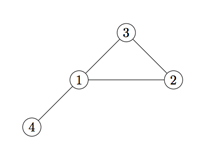

## 문제

It was decided to organize a vote in the Kingdom of Byteland. To take part in it one has to travel to closest town where polling station is to be set up. Each one of inhabitants should take part in this vote but most of them are very lazy thus will not vote if closest polling station is located more than one day travel from their home town. Since there are many people living in the countryside, next to some roads, for every road there should be a polling station in at least one of the town it connects. Wise King wants to select as few towns as possible, but his advisors don’t know how to deal with this problem. Help them find the towns, where polling stations can be located.

## 입력

The first line of each file contains two integers n, m (1 ≤ n ≤ 50 000, 1 ≤ m ≤ 500 000) indicating the number of towns in the kingdom and the number of roads. Towns are numbered from 1 to n. Each of the next m lines will contain two integers ai, bi, (1 ≤ ai, bi ≤ n, ai ≠ bi), indicating that it is possible to travel between towns ai and bi, which takes one day.

## 출력

Your output should consist of two lines. The first line should contain a single integer k indicating the number of polling stations in your solution. In the second line there should be a sequence of k town numbers, in which polling stations should be set. The score for each test depends on the size of your solution. The solution needs to be correct to get any points. If it uses y polling stations, whereas in the best known solution, which is not necessarily optimal, there are b stations, you will be awarded 10((8b−7y)/b)2 points (rounded to the closest integer).

## 힌트

