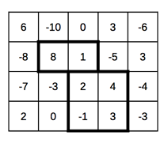

## 문제

정수로 이루어진 N \* M 행렬이 주어질 때, 당신은 K개의 겹치지 않는 부분행렬을 골라서, 부분행렬 안에 속하는 원소들의 합을 최대화하려고 한다.

## 입력

첫 번째 줄에 N, M, K가 주어진다. 행렬의 크기와, 고를 부분행렬의 수를 뜻한다. (1 <= K <= 3, K <= N, M <= 300)

이후 N개의 줄에 M개의 수가 주어진다, i번 행 j번 열의 원소 aij (−20 000 ≤ aij ≤ 20 000) 를 뜻한다.

부분행렬은, 행렬 내의 부분 직사각형 격자를 뜻한다. 두 부분행렬이 겹침은, 공통 원소를 포함함을 뜻한다.

## 출력

부분행렬에 속하는 모든 원소들의 합의 최댓값을 출력하라.

## 힌트

