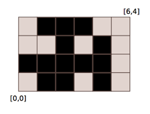

## 문제

Lukas has a large grid. Initially, all squares of the grid are of white colour. Lukas has three patterns (numbered from one to three, starting with the left one):

```

XXXX    X.X.    X.X.
....    X.X.    .X.X
XXXX    X.X.    X.X.
....    X.X.    .X.X
```

He applies patterns on the grid. He chooses a rectangle, chooses a pattern and paints some squares with black colour according to the pattern. He repeats this N times. When painted areas overlap, he obeys the OR rule. For example, if he chooses pattern 1 and then pattern 3 on a square 4 × 4, he gets

```

XXXX
.X.X
XXXX
.X.X
```

Your task is to compute number of black squares after Lukas has painted all rectangles. The pattern begins in the top left corner of a rectangle (the lowest x and the highest y coordinate).

## 입력

In the first line of input, there is number N(0 ≤ N ≤ 100, 000). N lines follow. In each of these lines, there are five integers x1, y1, x2, y2, p, where x1, y1 and x2, y2 are the coordinates of grid points in two opposite corners of the rectangle, in which a pattern is applied, and p(1 ≤ p ≤ 3) is the number of the used pattern. Coordinates of rectangles do not exceed 109 in their absolute value and each rectangle is at least one unit high and wide.

## 출력

The first and only line of output should contain number of black squares.

## 힌트


