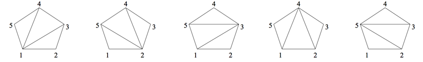

## 문제

삼각분할이란 볼록 다각형의 대각선을 이용해서 삼각형으로 분할하는 것이다. 두 대각선은 교차할 수 없다. 삼각분할을 이루는 대각선의 집합이 다르면 두 삼각분할은 서로 다른 삼각분할이다. (꼭짓점에 1번부터 N번까지 번호를 붙인다)

오각형을 삼각분할하는 방법은 총 다섯가지가 있으며, 아래 그림과 같다.

Tn을 n각형을 삼각분할하는 방법의 수라고 했을 때, T3 + T4 + ... + Tn을 구하는 프로그램을 작성하시오.

## 입력

첫째 줄에 n과 m이 주어진다. (3 ≤ n ≤ 100,000, 2 ≤ m ≤ 109)

## 출력

T3 + ... + Tn을 m으로 나눈 나머지를 출력한다.
