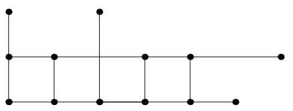

## 문제

Marek loves mathematics, especially geometry. Once he was bored, he took his favourite ruler a drawed horizontal and vertical line segments. After several hours he took his paper and look at it. He spot a rectangle. No, 2 rectangles. 3,4,. . . 1347 rectangles. But he was not sure, so he started counting from beginning and counted 1374 rectangles. He was confused. Maybe he first time forgot to count something, or the second time he counted something twice. Help Marek and find how many rectangles he has drawn.

Your task is to compute the total number of rectangles formed by the line segments.

## 입력

The first line of the input contains the number of line segments N, 4 ≤ N ≤ 800. Next N lines contains four number x1, y1, x2, y2, −1 000 000 000 ≤ x1, y1, x2, y2 ≤ 1 000 000 000. Here x1, y1 is start of the line segment and x2, y2 is the end of the line segment. You may assume that every line segment is parallel to the x-axis or to the y-axis.

## 출력

Your output should contain a sigle line with the number of rectangles.

## 힌트

Marek drawed four 1×1 rectangles, three 2×1 rectangle, two 3×1 rectangles and only one 4×1 rectangle.
