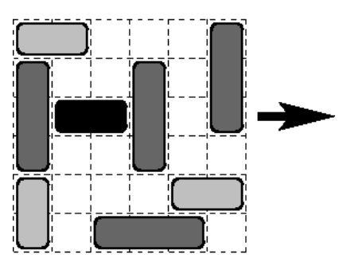

## 문제

Traffic jam is a real nightmare of all drivers. Nobody likes to be stuck in the overfilled streets, when the cars move very slowly, if they even move at all. Professional drivers face traffic jams quite often. Can you help them to find the way out of the traffic jam?

We can model a small (but complicated) traffic jam on a 6 x 6 grid of squares. Vehicles (cars and trucks) are scattered over the grid at integer locations, as shown below. Both types of vehicles are 1 square wide. Cars are 2 squares long, and trucks are 3 squares long. Vehicles may be oriented either horizontally (East-West) or vertically (North-South) relative to the grid.

Vehicles cannot cannot move through each other, cannot turn, and cannot move over the edge of the grid. They can move in their direction (horizontally-oriented vehicles cannot move vertically and vice versa), as long as they are not blocked by another vehicle or by the edge of the grid. Only one vehicle may move in a single step, but it may move by as many squares at a time as possible, providing there is enough empty space.

Our goal is to move vehicles back and forth until a particular horizontally-oriented vehicle (your own car — the black one on the picture above) leaves the rightmost (eastern-most) edge of the grid, where it is considered to have escaped the traffic jam. You are to write a program that will find a solution requiring the minimum possible number of moves.

## 입력

The input contains the description of one traffic jam. On the first line there is a single integer n (1 ≤ n ≤ 10) giving the number of vehicles in the traffic jam. The input continues with n lines, each of them containing a description of one vehicle. The first character of the vehicle description is either h (meaning that the vehicle is oriented horizontally) or v (the vehicle is oriented vertically). It is followed by a space and two integers r, c (1 ≤ r, c ≤ 6) separated by a space. The integers specify the upper-left square occupied by the vehicle. Finally there is a space and either the character c or t determining whether the vehicle is a car or a truck. The first vehicle in the description is the one that should leave the grid and you can assume that it is a car and that it is oriented horizontally.

## 출력

The output should contain the minimal number of moves needed to move the first car out of grid over its right end, or the string 'The car is trapped.' in case it is not possible to move the first car out.
