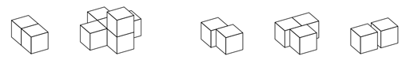
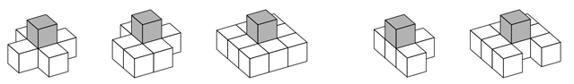

## 문제

아즈텍의 황제 쿠이틀라우악은 자신의 명예를 위해 피라미드를 만들려고 한다.

아즈텍 피라미드는 돌 블록을 이용해서 만든다. 블록은 1×1×1 크기의 정육면체이다. 쿠이틀라우악은 피라미드의 설립식 때, 블록 하나를 직접 땅에 놓았다. 그 다음 블록부터는 인부들이 설치하며, 이전에 놓여진 블록과 적어도 한 면 전체를 공유해야 한다.

왼쪽 두 개는 가능한 블록의 배치, 오른쪽 세 개는 불가능한 배치이다.

블록은 땅의 바로 위에 있거나, 블록의 아래에 있는 블록의 모든 면이 땅이나 다른 블록과 접할 때, 안정적이라고 한다. 피라미드의 모든 블록은 안정적이어야 한다.

아래 그림은 회색 블록을 놓았을 때이며, 그 블록이 안정적인 경우는 왼쪽 세 개, 아닌 경우는 오른쪽 두 개이다.

사용할 수 있는 블록의 개수가 주어졌을 때, 그 블록으로 만들 수 있는 가장 높은 안정적인 피라미드의 높이를 구하는 프로그램을 작성하시오.

## 입력

첫째 줄에 사용할 수 있는 블록의 수 n이 주어진다. (1 ≤ n ≤ 109)

## 출력

첫째 줄에 블록 n개로 만들 수 있는 가장 높은 안정적인 피라미드의 높이를 출력한다.
