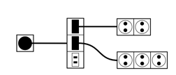

## 문제

알렉스 퍼거슨은 맨유 감독에서 은퇴한 뒤에 집에서 프로그래밍을 즐기고 있다. 그는 많은 사람들과 함께 프로그래밍을 하는 것을 좋아하기 때문에, 집에 많은 컴퓨터를 설치하려고 한다.

그가 살고있는 스코틀랜드에는 콘센트와 전기 플러그에 대한 표준이 두 개다. 이 표준은 서로 호환성이 없기 때문에, 표준 A에 해당하는 플러그는 표준 A에 해당하는 콘센트에만, B에 해당하는 플러그는 B에 해당하는 콘센트에만 꽂을 수 있다.

퍼거슨의 집에는 콘센트가 딱 한 개 있다. 이 콘센트는 표준 A에 해당한다. 스코틀랜드에서 파는 모든 컴퓨터는 표준 A 플러그를 사용한다. 따라서, 콘센트에 꽂을 수 있는 컴퓨터는 하나밖에 없다. 하지만, 퍼거슨은 멀티탭을 가지고 있다. 멀티탭은 다음과 같이 두 종류가 있다.

* 첫 번째 멀티탭은 표준 A 플러그를 사용 하고, 표준 B 콘센트를 여러 개 가지고 있다.
* 두 번째 멀티탭은 표준 B 플러그를 사용 하고, 표준 A 콘센트를 여러 개 가지고 있다.

이 멀티탭은 매우 강력하기 때문에, 폭발하지 않고 모든 전류를 견뎌낼 수 있다. 따라서, 첫 번째 멀티탭을 콘센트에 꽂은 다음에, 그 콘센트에 두 번째 멀티탭을 꽂고... 이런식으로 꽂다보면 표준 A에 해당하는 콘센트를 많이 얻을 수 있게 된다.

퍼거슨이 가지고 있는 각 멀티탭의 개수가 주어졌을 때, 표준 A 콘센트를 최대 몇 개 만들 수 있는지 구하는 프로그램을 작성하시오.

## 입력

첫째 줄에는 퍼거슨이 가지고 있는 첫 번째 멀티탭의 개수 n, 두 번째 멀티탭의 개수 m이 주어진다. (0 ≤ n, m ≤ 100,000)

둘째 줄에는 첫 번째 멀티탭에 있는 콘센트의 개수 ai가 공백으로 구분되어 주어진다. (1 ≤ ai ≤ 1000)

셋째 줄에는 두 번째 멀티탭에 있는 콘센트의 개수 bi가 공백으로 구분되어 주어진다. (1 ≤ bi ≤ 1000)

## 출력

최대 몇 개의 컴퓨터를 사용할 수 있는지 출력한다.

## 힌트

예제의 경우 위와 같이 꽂으면 컴퓨터 5개를 사용할 수 있다.
