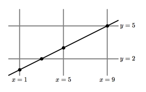

## 문제

Gerald has spent several hours drawing a rectangular grid on a sheet of paper. At the beginning, he drew some vertical lines with equal distance (dx) between them. Than he drew some horizontal lines, also with equal distance (dy) between them. Both dx and dy are greater than zero.

While Gerald was relaxing with a cup of tea, his brother Mike came and scratched a straight line on the sheet. Gerald felt outraged with Mike’s behavior and ordered him to remove everything odd from the paper.

Mike didn’t take his brother’s words seriously and removed almost all the information with an eraser. However, he did not notice the points of intersection of his line with the grid. All those points were bold enough to be readable even after erasing.

Help Gerald to find the parameters of the original grid.

## 입력

The first line of input contains single integer n — the number of points of intersection (3 ≤ n ≤ 100 000).

Each of the following n lines contains a pair of integer number xi, yi — the coordinates of the intersection point. Coordinates do not exceed 109 by the absolute value.

All the intersection points are distinct. There are no common points of the grid and the Mike’s line except for the specified ones.

## 출력

Output six integer numbers x1, x2, dx, y1, y2 and dy. First three numbers describe the set of vertical lines: the minimum x-coordinate of the vertical line, the maximum x-coordinate of the vertical line, and the distance between adjacent vertical lines (−109 ≤ x1 ≤ x2 ≤ 109; 0 < dx ≤ 2 · 109). Following three numbers should describe the set of horizontal lines in the same way with x replaced by y (−109 ≤ y1 ≤ y2 ≤ 109; 0 < dy ≤ 2 · 109).

It is guaranteed that at least one solution exists.
