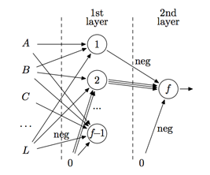
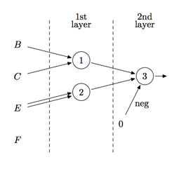

## 문제

You probably know about artificial neural networks and their learning algorithms. Sometimes people even believe that neural networks can magically solve any problem “by themselves”. However, in this problem we will treat neural networks as a simple computation model. You are asked to write a program, intelligently designing a neural network computing a given logical formula.

The logical formula may contain input variables from A to L, constants 0 and 1, combined with logical  operators: equivalence (⇔), implication (→), disjunction (∨), conjunction (∧), and negation (¬) according to the following grammar:

```

⟨expression⟩ ::= {⟨implication⟩ ⇔}∗ ⟨implication⟩
⟨implication⟩ ::= ⟨disjunction⟩ | ⟨disjunction⟩ → ⟨implication⟩
⟨disjunction⟩ ::= ⟨conjunction⟩ | ⟨disjunction⟩ ∨ ⟨conjunction⟩
⟨conjunction⟩ ::= ⟨term⟩ | ⟨conjunction⟩ ∧ ⟨term⟩
⟨term⟩ ::= A ... L | 0 | 1 | ¬ ⟨term⟩ | (⟨expression⟩)

Here {X}∗ means repetition of X zero or more times.
```

The semantics of operations is traditional, except for equivalence. Equivalence of several arguments written in a row inside the same expression is 1 when and only when all arguments have equal values.

For this problem we will use the following neural network model. The signals are binary (either 0 or 1). Each network node is a majority element — its axon (output) is 1 then and only then, when more than a half of its dendrites (inputs) are 1. For example, if some node has four dendrites, then its axon switches to 1 when at least three dendrites are set to 1. Each node may be programmed to negate some of its dendrites before computing majority function.

The network must contain two layers. If ƒ is the number of its nodes, then ƒ − 1 nodes (indexed from 1 to ƒ − 1) must belong to the first layer and the last node (number ƒ) — to the second layer. The function inputs may be connected to the first layer dendrites only, the first layer axons may be connected to the second layer dendrites only, the second layer axon is the network output. Any dendrite may also be connected to constant 0.



This fragment of some neural network demonstrates various connection types. Here input A is connected to nodes 1 and ƒ −1, inputs B and L are connected to all first layer nodes, while input C connected only to node ƒ − 1. Constant zero is connected to node 2 twice, so this node has four dendrites; similarly, node 2 is connected to node ƒ three times. Axon of node ƒ − 1 is not connected. Connections of input L to node ƒ − 1, node 1 to node ƒ, and constant zero to node ƒ are negated.

## 입력

The only line of the input contains a logical formula (not longer than 300 000 symbols). Logical operations are represented by ‘<=>’ (equivalence), ‘->’ (implication), ‘|’ (disjunction), ‘&’ (conjunction), and ‘~’ (negation). The variables ‘A’ ... ‘L’ and constants ‘0’ and ‘1’ stand for themselves. The formula contains no spaces or other symbols not mentioned in the grammar.

## 출력

The first line of the output must contain ƒ — the number of nodes (2 ≤ ƒ ≤ 5000). The following ƒ lines describe connections of the network, a line per node, in the order of the node’s indexes.

Each node description line contains the number of the node dendrites Dk (1 ≤ Dk ≤ 5000), followed by Dk values, explaining connection of each dendrite. Each value is either 0 (for zero constant), or input variable name, or integer from 1 to ƒ − 1 (standing for axon of the corresponding 1st layer node). The value may be preceded with tilde (‘~’), standing for negation of the corresponding dendrite signal.

## 힌트

The solution is visualized in the picture below.



Here two dendrites of node 2 are connected to the same input E. Node 3 is connected to two first layer nodes 1 and 2 and to constant zero. The zero connection is negated. Input F is not connected to any node.
