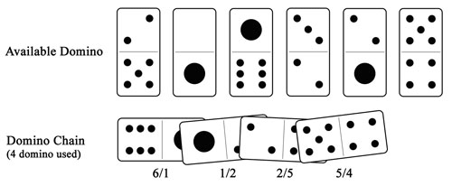

## 문제

A domino is a 2x1 rectangular tile with a line dividing its face into two squares, each with a certain number of dots from zero spots to six spots. As you might know, there are many different games which can be played using dominoes. In most games, dominoes are played by arranging them into a single chain where adjacent dominoes must have matching numbers (see example illustration below).

There are 28 possible faces in a complete set of domino: 0-0, 0-1, 0-2, 0-3, 0-4, 0-5, 0-6, 1-1, 1-2, 1-3, 1-4, 1-5, 1-6, 2-2, 2-3, 2-4, 2-5, 2-6, 3-3, 3-4, 3-5, 3-6, 4-4, 4-5, 4-6, 5-5, 5-6, 6-6. Of course you can play each domino in either direction. For example, you can play 1-6 as 1/6 or 6/1 depending on your need.

Write a program to find the longest chain that can be made from a given set of dominoes. There may be more than one domino with the same face.

## 입력

Input contains several cases. Each case begins with an integer N (1 <= N <= 1,000) denoting the number of available domino. Each of the following N lines contains a pair of number (0 to 6) which represents the domino. The first number in each pair is always smaller or equal to the second number.

## 출력

For each case, print in a single line the number of domino used in the longest domino chain.
