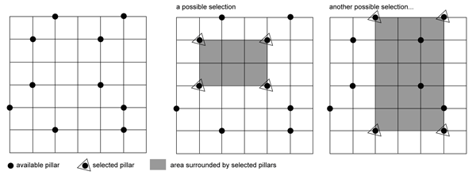

## 문제

Sultan Al-Bandar, the ruler of Old West Sumatra Sultanate, has decided to give his land to his only son. Although the Sultan believes that his son will not misuse the land for some bad purposes, he still has some doubts on his son's capability to rule the land. Therefore, he decided to give his son a test, a puzzle test.

The Sultan drew N x N grids (virtually of course) on his land where any two adjacent grid intersections would have the same length. Then he placed some pillars on the land where each pillar was placed at one intersection. Then he summoned his son to come to the land.

"Well, my dear son, if you are to choose four pillars to form an area where each pillar serves as a corner of that area, how many possible selections are there?" asked the Sultan. His son replied him with a big smile. Just at the time the Sultan remembered that his son works for the Sultanate's Advance Combinatorial Ministry, so this problem might be too easy. Then he quickly added, "Oh! Each side of the area should be parallel to the grid I have drawn before."

To tell the truth, the Sultan himself actually had not prepared any answers since he spontaneously asked his after the big smile. Help this Sultan by writing a program to count how many possible selections can be made by applying the rules above.

## 입력

The input contains several test cases. Each case begins with two integers, N (2 <= N <= 100) the grid-size, and P (2 <= P <= N2) the number of pillars. Each grid will be numbered from 1 to N. The next P following lines each will contains two integers: r and c (1 <= r, c <= N) the row and column where the pillar is placed.

Input is terminated by a line containing two zeroes. This input should not be processed.

## 출력

For each case, output a line containing the number of possible selections can be made to form an area whose sides are parallel to the grid.
