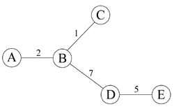

## 문제

트리는 사이클을 갖지 않는 연결된 그래프이다.

중앙 정점은 모든 정점으로 이르는 비용의 합이 가장 작은 정점이다. 트리의 정점 개수가 작은 경우에는 모든 경우의 수를 다 계산해보는 프로그램을 이용해 쉽게 구할 수 있다.

위의 그림은 가중치가 있는 트리로, 정점의 개수는 5개이다. 이 트리의 중앙 정점은 B이다.

B-A = 2, B-D = 7, B-C = 1, B-E = 7+5=12, 총: 2+1+7+12 = 22

N이 큰 경우에 문제를 풀어보자.

트리를 입력 받아, 모든 정점과 중앙 정점까지 비용의 합을 구하는 프로그램을 작성하시오.

## 입력

입력은 여러 개의 테스트 케이스로 이루어져 있다. 각 테스트 케이스의 첫 줄에는 트리의 정점의 수 n이 주어진다. (1 ≤ n ≤ 10,000) 각 정점은 0번부터 n-1번까지 번호가 붙여져 있다. 다음 n-1개 줄에는 세 정수 a, b, w가 주어진다. (1 ≤ w ≤ 100) a와 b는 간선을 나타내고, w는 그 간선의 가중치이다.

입력의 마지막 줄에는 0이 하나 주어진다.

## 출력

각 테스트 케이스마다 모든 정점과 중앙 정점 사이의 비용의 합을 출력한다.
