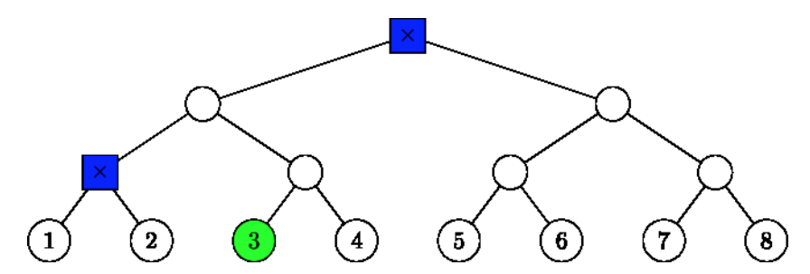

## 문제

Two pandas A and B like each other. They have been placed in a bamboo jungle (which can be seen as a perfect binary tree graph of 2N-1 vertices and 2N-2 edges whose leaves are all of the same depth) at different locations. The jungle organizers (yes, such organizers exist), being a bit disorganized, only note down two integers X and Y as an indicator of the location of a panda which is translated as: that panda is now at a vertex whose distance is exactly Y vertices away from the leaf X. The leaves are numbered from 1 to 2N-1 from left to right. As you might have noticed, this indicator may correspond to more than one vertex. For example, the image below shows possible locations for N = 4, X = 3, Y = 3.

Back to our two pandas, the indicators of the locations of these two pandas are (XA, YA) and (XB, YB). One can shout to another such that if they are at most Z vertices away from each other, the other can hear that shout. The question is, given the height of the jungle layout, the location indicators of these two pandas and the strength of their shouts, is it possible that these two pandas cannot hear each other's shout?

## 입력

The first line of input contains an integer T (T ≤ 50,000) denoting the number of testcases. Each testcase is represented by a single line containing 6 space-separated integers N, XA, YA, XB, YB, and Z (1 ≤ N ≤ 31; 1 ≤ XA, XB ≤ 2N-1; 0 ≤ YA, YB, Z ≤ 2 \* N - 2) denoting the height of the perfect binary tree jungle layout, the location indicators of the two pandas, and the strength of their shouts.

## 출력

For each testcase, write "YES" to a single line of output if it is the case that these two pandas might not be able to hear each other's shout, and "NO" otherwise.
