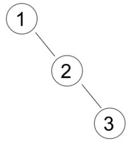
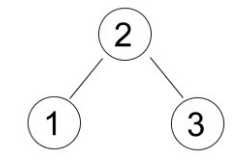
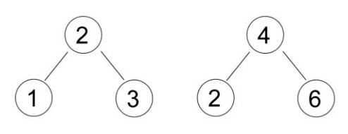

## 문제

Binary Search Tree (BST) is a rooted binary tree data structure which has following properties:

* Left subtree contains only nodes with value less than the node's value.
* Right subtree contains only nodes with value greater than the node's value.
* All values in the nodes are unique.
* Both left and right subtrees are also binary search tree recursively.

If there is a new node to be inserted, the following algorithm will be used:

1. If the root is empty, then the new node becomes the root and quit, else continue to step 2.
2. Set the root as current node.
3. If the new node's value is less than current node's value:
   * If current node's left is empty, then set the new node as current node's left-child and quit.
   * else set current node's left-child as current node, and repeat step 3.
4. If the new node's value is greater than current node's value:
   * If current node's right is empty, then set the new node as current node's right-child and quit.
   * else set current node's right-child as current node, and repeat step 3.

BST structure depends on its data inserting sequence. Different sequence may yield a different structure though the data set is the same. For example:

Insert sequence: 1 2 3, the BST will be:

If the data is inserted with sequence: 2 1 3, the tree will be:

On the other hand, different data set may have a same BST structure. For example:

Insert sequence 2 1 3 will have the same BST structure with 4 6 2, and the tree will be:

Given N nodes BST, calculate how many distinct insert data sequence which result in the same BST structure, assuming that data are taken from range 1..M.

## 입력

The first line of input contains an integer T (T ≤ 100), the number of test cases. Each case begins with two integers N and M (1 ≤ N ≤ M ≤ 1,000), the number of nodes in BST and the maximum range respectively. The next line contains N integers Ai (1 ≤ Ai ≤ 1,000) the insert sequence that construct a BST.

## 출력

For each case, output an integer denoting the number of distinct insert data sequence which result in the same BST structure, assuming that data are taken from range 1..M. Modulo this number with 1,000,003.
