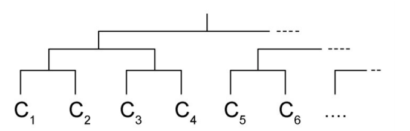

## 문제

As you might have heard, Mr. Kumis is holding an arm wrestling tournament. There are 2N contestants who will participate in this tournament numbered from 1 to 2N. The first contestant (C1) will compete with the second contestant (C2). C3 will compete with the C4, and so on. The winner of C1 and C2 will compete with the winner of C3 and C4. The winner of C5 and C6 will compete with the winner of C7 and C8, and so on (see the diagram below).

Each contestant initially has Pi strength. When two contestants wrestle, the stronger one will win and his strength will be reduced as much as his enemy‟s strength. However, before his next match, he has time to regain his strength and will recover at most K strength but his strength will not exceed his initial strength (Pi). If two contestants possess an equal strength then the contestant with smaller index will win.

Given the initial strength of all contestants, determine who will win the tournament and which contestant he will beat.

## 입력

The first line of input contains an integer T (T ≤ 100) denoting the number of testcases. Each testcase begins with two integer N (1 ≤ N ≤ 15) and K (0 ≤ K ≤ 1,000). The next line contains 2N integers Pi (1 ≤ Pi ≤ 1,000) denoting the initial strength of ith contestant for i = 1..2N.

## 출력

For each testcase, print two lines. The first line contains an integer, the winner of the tournament. The second line contains N integers which are all contestants the winner beat based on match order. Each integer is separated by a single space.
