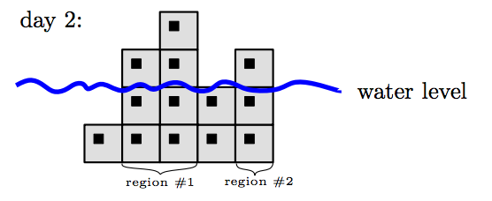

## 문제

In a seaside village, there is an avenue of skyscrapers. Each skyscrapers is 100m wide and has certain height. Due to very high price of parcels, any two consecutive skyscrapers are adjacent. The avenue lies close to the beach so the street is exactly at the sea level.

Unfortunately, this year, due to the global warming, the sea level started to increase by one meter each day. If the skyscraper height is no greater than the current sea level, it is considered flooded. A region is a maximal set of non-flooded, adjacent skyscrapers. This term is of particular importance, as it is sufficient to deliver goods (like current, carrots or cabbages) to any single skyscraper in each region. Hence, the city major wants to know how many regions there will be in the hard days that come.

An example of an avenue with 5 skyscrapers after 2 days is given below.

## 입력

The input contains several test cases. The first line contains an integer t (t ≤ 15) denoting the number of test cases. Then t test cases follow. Each of them begins with a line containing two numbers n and d (1 ≤ n, d ≤ 106), n is the number of skyscrapers and d is the number of days which the major wants to query. Skyscrapers are numbered from left to right. The next line contains n integers h1, h2, . . . , hn where 1 ≤ hi ≤ 109 is the height of skyscraper i. The third line of a single test case contains d numbers tj such that 0 ≤ t1 < t2 < . . . < td−1 < td ≤ 109.

## 출력

For each test case output d numbers r1, r2, . . . , rd, where rj is the number of regions on day tj.
