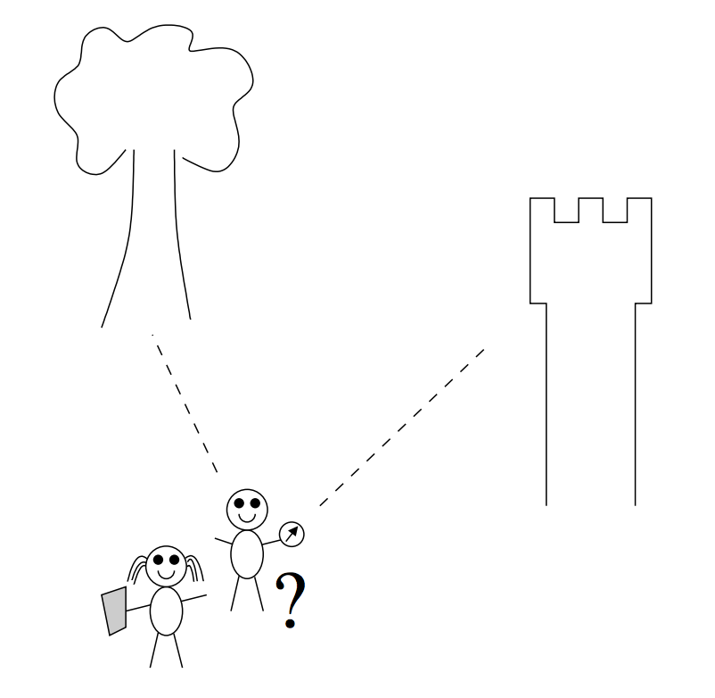

## 문제

On a warm summer afternoon, Hansel and Grethel are walking together in the fields. It is getting late and, to be honest, they are lost. Grethel is a little scared, still vividly remembering the last time they got lost in the forest. That time, an evil witch had locked them inside a house built of gingerbread and sugar! But Hansel can reassure her: this time they are well prepared. Hansel has taken a map and a compass with him!

Hansel picks two clearly outstanding features in the landscape, and uses the compass to measure the direction towards both objects. Grethel locates the objects on the map, and writes down the corresponding map coordinates. Based on this information, they will be able to accurately determine their own position on the map.

The coordinates of two marker objects, and the direction (angle from the North) towards these objects are known. Write a program which uses this data to calculate the coordinates of Hansel and Grethel’s current location.

## 입력

The first line of the input contains one positive number: the number of situations in which a position must be determined. Following are two lines per situation, describing the two marker objects. Each marker object is described by a line containing three integer numbers:

* the x-coordinate of the object on the map (0 ≤ x ≤ 100); the x-axis runs West-to-East on the map, with increasing values towards the East.
* the y-coordinate of the object on the map (0 ≤ y ≤ 100); the y-axis runs South-to-North on the map, with increasing values towards the North.
* the direction d of the object in degrees (0 ≤ d ≤ 360); with 0° = North, 90° = East, 180° = South, and so on.

To keep the position calculations accurate, Hansel makes sure that the directions of the two objects are not exactly equal, and do not differ by exactly 180°.

## 출력

One line per situation, containing the result of the position calculation: two numbers, separated by a space, each having exactly 4 digits after the decimal point. These numbers represent the x and y coordinates of the position of Hansel and Grethel (0 ≤ x, y ≤ 100). Round the numbers as usual: up if the next digit would be ≥ 5, down otherwise.
