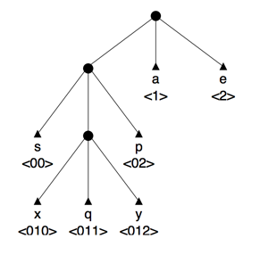

## 문제

데이터를 압축하는 방법 중에서 상대적으로 간단한 방법은 허프만 트리를 이용하는 것이다. 허프만 트리를 이용하면 한 파일이 포함하고 있는 데이터를 압축하고 압축 해제하는 작업을 손쉽게 할 수 있다. 많은 응용프로그램은 바이너리 허프만 트리를 사용한다. (각 노드는 리프이거나 두 서브 노드를 갖는 경우) 이 문제에서는 임의의 서브 트리의 개수를 갖는 허프만 트리를 사용한다. (N-ary tree)

파일의 내용에 총 Z개의 서로 다른 글자가 있는 경우에 리프 노드의 개수는 Z개이다. 루트에서 리프로 향하는 경로 상에 쓰여 있는 숫자가 그 글자를 어떻게 인코딩할 것인지를 나타낸다. 노드에 쓰여 있는 숫자는 0부터 N-1까지이다.

자주 사용하는 글자를 루트와 가까운 곳에 놓고, 잘 사용하지 않는 글자를 먼 곳에 놓으면, 압축 효율을 늘릴 수 있다. 즉, 한 파일을 압축하는데 있어서 최소 개수의 N-ary 심볼을 사용한 트리를 허프만 트리라고 한다.

이 문제에서, 사용할 허프만 트리는 각 노드가 내부 노드이거나, 글자를 인코딩하는 리프 노드이다. 아무 글자도 인코딩하지 않는 dangling leave는 존재하지 않는다.

아래 그림은 N=3인 경우의 허프만 트리 예시이다. 'a'와 'e'는 심볼 1개로 인코딩 되며, 덜 사용하지 글자인 's'와 'p'는 심볼 2개, 드물게 사용하는 글자인 'x','q','y'는 세 개로 인코딩한다.

디코딩을 해야 원래 파일로 복원할 수 있기 때문에, 한 데이터를 인코딩하는데 사용한 트리를 기억하는 것이 중요하다. 트리를 저장하는 방법에는 여러 가지가 있다. 이 문제에서는 모든 Z개의 문자가 사전순으로 하나씩 쓰여 있는 파일을 인코딩한 결과를 저장하는 방식으로 트리를 저장할 것이다.

N과 위에서 저장한 트리가 주어졌을 때, 각각의 글자가 어떤 심볼로 인코딩 되는지 구하는 프로그램을 작성하시오.

## 입력

첫째 줄에 테스트 케이스의 개수 T가 주어진다. 각 테스트 케이스는 아래와 같이 세 줄로 이루어져 있다.

* 파일에 들어있는 서로 다른 글자의 개수 2 ≤ Z ≤ 20
* 허프만 트리의 arity를 나타내는 2 ≤ N ≤ 10 (N진 트리로 생각하면 됩니다. N = 2인 경우엔 binary, 3인 경우엔 ternary)
* 모든 글자가 사전 순으로 한 번씩 나타난 파일을 인코딩 한 결과. 길이는 200을 넘지 않으며, 항상 [0, (N-1)]에 들어있는 숫자로만 이루어져 있다.

Z=5, N=2인 경우에 010011101100은 여러 가지 정답이 나올 수 있다. 하지만, 이 문제에서는 답이 유일한 경우만 입력으로 주어진다.

## 출력

각각의 테스트 케이스에 대해서, Z줄을 출력해야 한다. 각 줄은 original->encoding 형식이고, original은 글자, encoding은 허프만 트리에 의해서 인코딩된 결과이다.
