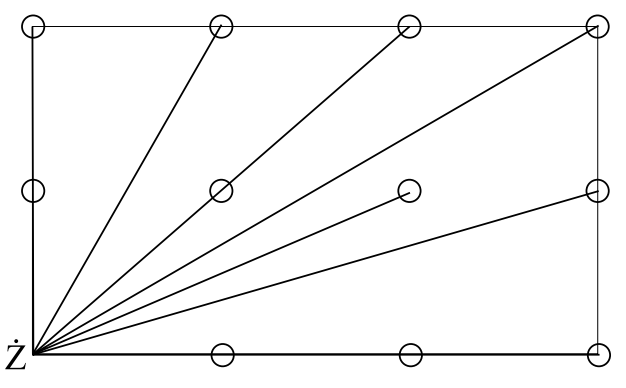

## 문제

Ciekawe, czy tylko ludzie miewają marzenia senne? Jeśli tak, to poniższa historia wyda Wam się nieprawdziwa...

Pewnej płaskiej żabie śniło się, że znajduje się w jednym z rogów płaskiego prostokątnego pokoju o wymiarach n na m jednostek. Żabie przyśniło się, że pokój jest pełen, mniam mniam, smakowitych muszek. Muszki, mniam mniam, znajdują się we wszystkich punktach pokoju o współrzędnych całkowitych z wyjątkiem punktu, w którym stoi żaba. Mniam mniam. W sumie więc w pokoju jest (n + 1)(m + 1) − 1 pysznych muszek. Sen nie trwał długo. Gdy żaba się obudziła, zaczęła się zastanawiać, ile wysiłku kosztowałoby ją zjedzenie wszystkich muszek. Mniam mniam. Żaba dysponuje językiem, który, jak każde dziecko wie, jest bardzo długi (dosięgnie każdej, mniam, muszki w pokoju), a żaba może go wyciągać w linii prostej. Gdy żaba wyciągnie język w danym kierunku, każda muszka, mniam mniam, która znajdzie się na jego drodze, przykleja się do niego i jest przez żabę konsumowana. Och, mniam mniam. Pomóż żabie i powiedz, ile minimalnie razy musi ona wyciągnąć język, aby zjeść wszystkie, mniam mniam, muszki? Możesz założyć, że muszki są punktami, a język jest nieskończenie cienki.

## 입력

W pierwszej linii pliku wejściowego znajduje się liczba naturalna d (1 ≤ d ≤ 100), określająca liczbę testów, których opisy znajdują się w kolejnych liniach.

Każdy test składa się z linii zawierającej dwie liczby całkowite n, m (0 ≤ n, m ≤ 106).

## 출력

Dla każdego testu wypisz linię zawierającą minimalną liczbę wyciągnięć języka potrzebną żabie do zjedzenia wszystkich muszek (mniam mniam) w pokoju.

## 힌트

