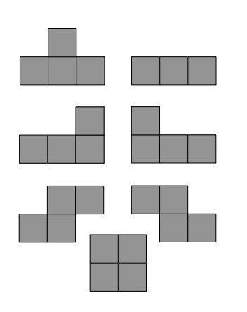

## 문제

Aby wybudować Kanał Panamski potrzeba było 20 milionów godzin ludzkiej pracy. Tymczasem w samym tylko 2003 roku na całym świecie przez 9 miliardów godzin ludzie układali komputerowego Pasjansa. Niestety nie wiemy, ile czasu ludzkość poświęciła grze Tetris. Kierując się, jednak, swoim doświadczeniem w tym temacie, sądzimy, że również bardzo dużo...

Dana jest prostokątna plansza o szerokości czterech pól i wysoko- ści n pól. Dany jest stan pól pierwszego wiersza planszy. Mamy do dyspozycji 7 różnych typów klocków (patrz rysunek) dowolną liczbę klocków każdego typu. Są to klocki używane zwykle w grze Tetris. Należy jednak zwrócić uwagę, że klocek „długi” zajmuje trzy pola, a nie cztery. Klocki wolno obracać. Na ile różnych sposobów można całkowicie pokryć planszę klockami?

## 입력

W pierwszej linii znajduje się liczba naturalna d (1 ≤ d ≤ 100), określająca liczbę testów.

Pierwsza linia testu zawiera liczbę n (1 ≤ n ≤ 109), określającą wysokość planszy. W drugiej linii znajdują się 4 znaki (’\*’ lub ’.’), określające stan pierwszego wiersza planszy. ’\*’ oznacza pole pokryte, a ’.’ pole wolne.

## 출력

Dla każdego testu oblicz liczbę różnych sposobów całkowitego pokrycia planszy przy pomocy dostępnych klocków. Wypisz resztę z dzielenia tej liczby przez 106.
