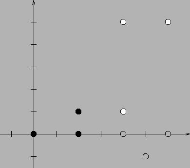

## 문제

A set of grid points in a plane (points whose both cartesian coordinates are integers) which we shall refer to as the pattern, as well as a group of other sets of grid points on the plane are given. We would like to know which of the sets are similar to the pattern, i.e. which of them can be transformed by rotations, translations, reflections and dilations so that they are identical to the pattern. For instance: the set of points {(0,0),(2,0),(2,1)} is similar to the set {(6,1),(6,5),(4,5)}, it is however not similar to the set {(4,0),(6,0),(5,-1)}.

Write a programme which:

* reads from the standard input the description of the pattern and the family of the investigated sets of points,
* determines which of the investigated sets of points are similar to the pattern,
* writes the outcome to the standard output.

## 입력

In the first line of the standard input there is a single integer k (1 ≤ k ≤ 25,000) - the number of points the pattern consists of. In the following k lines there are pairs of integers, separated by single spaces. The (i+1)’st line contains the coordinates of i’th point belonging to the pattern: xi and yi (-20,000 ≤ xi,yi ≤ 20,000). The points forming the pattern are pairwise different. In the next line there is the number of sets to be investigated: n (1 ≤ n ≤ 20). Next, there are n descriptions of these sets. The description of each set begins with a line containing a single integer l - the number of points belonging to that particular set (1 ≤ l ≤ 25,000). These points are described in the following lines, a single point per line. The description of a point consists of two integers separated by a single space - its coordinates x and y (-20,000 ≤ x,y ≤ 20,000). The points which belong to the same set are pairwise different.

## 출력

Your programme should write to the standard output n lines - one for each of the investigated sets of points. The i’th line should contain the word TAK (i.e. yes in Polish), if the i’th of the given sets of points is similar to the pattern, or the word NIE (i.e. no in Polish) if the set does not satisfy this condition.

## 힌트

