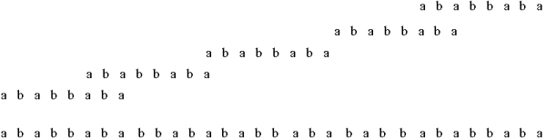

## 문제

Byteasar wants to put a rather long pattern on his house. In order to do this, he has to prepare an appropriate template with letters cut off first. He is going to put the pattern on the wall by putting the pattern on the wall in the appropriate place and painting over it. This way he can "print" all the letters that are on the template at one time (it is not possible to "print" only some of them). It is, however, possible, to paint some letters on the wall several times, as a result of different applications of the template. The letters on the template are adjacent (there are no spaces on it). Of course, it is possible to prepare a template with the whole pattern on it. But Byteasar would like to minimize the cost, so he wants to make a template as short as possible.

Write a programme that:

* reads from the standard input the pattern Byteasar wants to put on his house,
* determines the minimal length of the template needed to do it,
* writes the result to the standard output.

## 입력

In the first and only line of the standard input there is one word. It is the pattern Byteasar wants painted on his house. It consists of no more than 500,000 and no less than 1 lower-case (non-capital) letters of the English alphabet.

## 출력

In the first and only line of the standard output one integer should be written - the minimal number of letters in the template.

## 힌트

