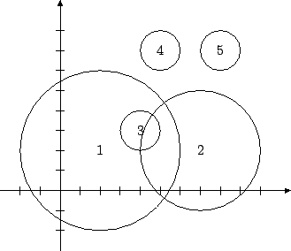

## 문제

Secretly Organized Tactical Infantry Exercises (SORTIE) take place in the Bledowska Desert. The main part of the SORTIE shall be the disarmament of a bomb, hidden in an unknown location in the desert.

The first part of the manoeuvres is an airborne operation. The commandos jump individually, in a predetermined order, from a helicopter hovering above the desert. Upon landing, each commando digs in and moves no further. Only then does the next commando proceed.

There is a survival radius defined for each commando. If the distance between the commando and the bomb is equal to (or smaller then) the survival radius, the commando will perish should the bomb go off. The command wants to minimize the number of soldiers taking part in the operation, but it wants to be sure that at least one of them survives the possible explosion.

We shall assume for our purposes that the Bledowska Desert is a plain and we shall identify the positions of the dug in commandos with points on this plane. We are given a sequence of commandos to jump. None of them may miss his turn, i.e. if the i-th commando jumps from the helicopter, than all those before him have already jumped. For each of the commandos we know his survival radius and the coordinates of the point he is going to land in, should he be required to jump.

Write a programme which:

* reads from the standard input a description of each commando,
* calculates the minimal number of commandos to jump,
* writes the outcome to the standard output.

## 입력

In the first line of the standard input there is a single integer n (2 ≤ n ≤ 2,000) - the number of commandos. The following n lines contain descriptions of commandos - one per line. The description of each commando is comprised of three integers: x, y and r (-1,000 ≤ x,y ≤ 1,000, 1 ≤ r ≤ 5,000). The point (x,y) denotes the landing place of the commando, and r denotes his survival radius. If the commando finds himself within the survival radius r from the bomb, he will perish should the bomb go off.

## 출력

In the first and only line of the standard output your programme should write a single integer - the minimal number of commandos required to jump in order to secure the survival of at least one of them, or a single word NIE (i.e. no in Polish) if it is not possible to have an unconditional certainty that one of the commandos survives.

## 힌트

