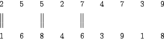

## 문제

2n soldiers are standing in a double-row. They have to be rearranged, so that there are no equally tall soldiers in each row - then we shall say, that the soldiers are set up properly.

A single operation consists in swapping two soldiers who occupy the same position (but in different rows). Your task is to determine the minimum number of swaps necessary to set the soldiers up properly.

Write a programme that:

* reads from the standard input the number and heights of soldiers, as they stand initially,
* determines the minimum number of swaps (of soldiers standing on the same position in different rows) necessary to set up soldiers properly,
* writes the result to the standard output.

## 입력

In the first line of the input there is one integer n, 1 ≤ n ≤ 50,000. In each of the two rows there are n soldiers standing. In each of the following two lines there are n positive integers separated by single spaces. In the second line there are numbers x1,x2,…,xn, 1 ≤ xi ≤ 100,000; xi denotes the height of the i'th soldier in the first line. In the third line there are numbers y1,y2,…,yn, 1 ≤ yi ≤ 100,000; yi denotes the height of the i’th soldier in the second line.

It is guaranteed that in the instances from the test data it is possible to set up soldiers properly.

## 출력

In the first and only line of the standard output one integer should be written - the minimum number of swaps necessary to set up soldiers properly.

## 힌트

There is a double-row of 18 soldiers in the figure. Arrows indicate the swaps that rearrange the soldiers in a proper way.

