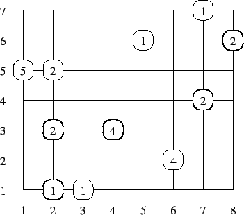

## 문제

The streets of Byte City form a regular, chessboardlike network - they are either north-south or west-east directed. We shall call them NS- and WE-streets. Furthermore, each street crosses the whole city. Every NS-street intersects every WE- one and vice versa. The NS-streets are numbered from 1 to n, starting from the westernmost. The WE-streets are numbered from 1 to m, beginning with the southernmost. Each intersection of the j’th NS-street with the 'th WE-street is denoted by a pair of numbers (i,j) (for 1 ≤ i ≤ n, 1 ≤ j ≤ m).

There is a bus line in Byte City, with intersections serving as bus stops. The bus begins its itinerary by the (1,1) intersection, and finishes by the (n,m) intersection. Moreover, the bus may only travel in the eastern and/or northern direction.

There are passengers awaiting the bus by some of the intersections. The bus driver wants to choose his route in a way that allows him to take as many of them as possible. (We shall make an assumption that the interior of the bus is spacious enough to take all of the awaiting passengers, regardless of the route chosen.)

Write a programme which:

* reads from the standard input a description of the road network and the number of passengers waiting at each intersection,
* finds, how many passengers the bus can take at the most,
* writes the outcome to the standard output.

## 입력

The first line of the standard input contains three positive integers n, m and k - denoting the number of NS-streets, the number of WE-streets and the number of intersections by which the passengers await the bus, respectively (1 ≤ n ≤ 109, 1 ≤ m ≤ 109, 1 ≤ k ≤ 105).

The following k lines describe the deployment of passengers awaiting the bus, a single line per intersection. In the (i+1)’st line there are three positive integers xi, yi and pi, separated by single spaces, 1 ≤ xi ≤ n, 1 ≤ yi ≤ m, 1 ≤ pi ≤ 106. A triplet of this form signifies that by the intersection (xi,yi)pi passengers await the bus. Each intersection is described in the input data once at the most. The total number of passengers waiting for the bus does not exceed 1,000,000,000.

## 출력

Your programme should write to the standard output one line containing a single integer - the greatest number of passengers the bus can take.

## 힌트

