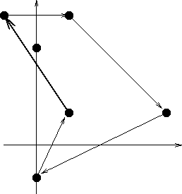

## 문제

Byteotia consists of N oasis in the desert, no three of which are collinear. Byteasar lives in one of these oasis and moreover he has an acquaintance in every other. Byteasar wants to pay a visit to as many of them as possible. He plans to travel on the back of his camel. The camel is as obstinate as a mule and thus moves in its own peculiar way:

* After departure from an oasis it moves along a straight line, until it gets to another oasis.
* The camel turns only at oasis, but it turns only right (clockwise) and by an angle from the interval [0°,180°] (the camel makes only one turn at an oasis, i.e. it will not turn by f.i.200° as a result of two subsequent turns by 100°).
* The camel doesn't want to follow its own footprints.

Help Byteasar in planning such a route that he will be able to visit as many friends as possible. It should both begin and end in the oasis where Byteasar lives. It has to consist of segments connecting subsequently visited oasis. The route may not pass through any point two times, except the Byteasar's oasis, where the camel turns up twice: at the beginning and the end of the journey.

Byteasar's camel is initially facing a certain oasis and it has to start moving toward it. The direction the camel faces after returning from the journey is of no importance.

Write a programme that:

* reads from the standard input the camel's coordinates and the direction it faces as well as the coordinates of the Byteotian oasis,
* determines the maximum number of friends Byteasar can pay a visit to while sticking to the presented rules,
* writes the result to the standard output.

## 입력

In the first line of the standard input there is one integer N (3 ≤ N ≤ 1,000) - the number of oasis in Byteotia. The oasis are numbered from 1 to N. Byteasar lives in the oasis no. 1 and his camel is facing the oasis no. 2. In the following N lines the coordinates of the oasis are given. In the (i+1)’th line there are two integers xi, yi - the horizontal and vertical coordinate of the i’th oasis - separated by a single space. All coordinates are from the interval from -16,000 to 16,000.

## 출력

In the first and only line of the standard output your programme should write one integer - the maximum number of friends Byteasar can visit.

## 힌트

