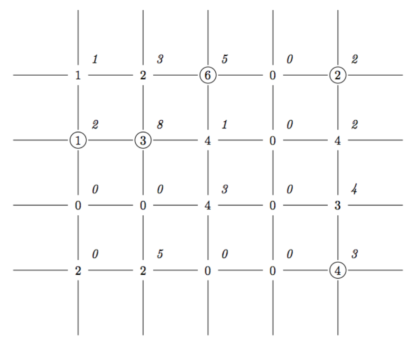

## 문제

20xx년, 경기과학고등학교는 국내 최대의 프로그래밍 대회인 ACM-ICPC Suwon Regional을 주최하게 되었다! 이번 수원 리저널에서는, 단순한 대회 주최 뿐만 아니라, 참가자들을 위한 수원시 버스 여행까지 계획되어 있고, 재현이는 이 버스 여행의 자세한 경로를 계획할 예정이다.

비록 2016년의 수원시는 정돈된 시가지하고는 거리가 멀지만, 20xx년의 수원시는 동-서 거리와 남-북 거리로 잘 정돈된 그리드 형태의 시가지를 가지고 있다. 서로 인접한 평행한 거리들은 100m 간격으로 떨어져 있다. 관광 명소는 항상 이러한 거리들의 교차로에 있는데, 재현이는 여행사를 통해서 각각의 관광 명소의 건설 시기 ai,j와 매력도 ci,j를 알고 있다.

재현이는 버스 여행을 통해 순서대로 여러 관광 명소를 방문할 계획이며, 이때의 매력도의 합을 최대화하려고 한다. 한편, 이번 버스 여행의 테마는 수원시의 역사이기 때문에, 건설 시기가 증가하는 (같아서는 안 된다!) 순으로 관광 명소를 방문하려고 한다. 또한, 수원시의 경치는 너무나도 아름다워서, 사람들은 버스 안에서 수원시의 경치를 감상하는 것을 즐긴다. 때문에, 두 관광 명소 사이를 이동하는 와중에도 매력도가 100m마다 1씩 증가한다.

재현이는 아무 관광 명소에서 시작해서, 중간에 여러 관광 명소를 들린 후, 아무 관광 명소에서 도착하는 여행 계획을 만들려고 한다. 가능한 여행 계획 중, 매력도의 합의 최댓값은 얼마인가? 버스는 두 관광 명소 사이를 최단 거리로 움직이며, 버스가 움직이는 동안 지나쳤던 관광지는 방문했다고 치지 않는다.

## 입력

첫 번째 줄에는 동-서 거리와 남-북 거리의 개수인 n, m 이 주어진다. (2 ≤ n, m ≤ 1000)

이후 n 개의 줄에 각각의 관광 명소의 건설 시기가 주어진다. 이 중 i번째 줄에는 m개의 정수 ai,j (0 ≤ ai,j ≤ 106) 가 주어지며, i번 동-서 거리와 j번 남-북 거리의 교차로를 의미한다. ai,j = 0 일 경우, **해당 거리의 교차로에는 관광 명소가 없다**. 관광 명소는 하나 이상 존재한다.

이후 n 개의 줄에 각각의 관광 명소의 매력도가 주어진다. 이 중 i번째 줄에는 m개의 정수 ci,j (0 ≤ ci,j ≤ 109) 가 주어지며, i번 동-서 거리와 j번 남-북 거리의 교차로에 있는 관광 명소의 매력도를 뜻한다. 만약에 해당 교차로에 관광 명소가 없다면, ci,j = 0 임이 보장된다.

## 출력

가능한 여행 계획 중, 매력도의 합의 최댓값을 출력하라.

## 힌트

재현이는 (2, 1) → (1, 5) → (2, 2) → (4, 5) → (1, 3) 순으로 관광 명소를 방문한다. 관광 명소의 매력도의 합은 2 + 2 + 8 + 3 + 5 = 20 이고, 이동 중에 쌓은 매력도의 합은 5 + 4 + 5 + 5 = 19 이다. 고로 총 매력도의 합은 39이다.
