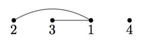

## 문제

크기 n의 순열은, 1부터 n까지의 정수가 정확히 한 번 등장하는 길이 n의 수열을 뜻한다. 이 순열을 a1, a2, ..., an 으로 표기하자. 순열 a를 통해서 순열 그래프를 만들 수 있다. 순열 그래프는 1, 2, ..., n의 번호를 가진 n개의 정점으로 이루어진 무방향 그래프이다. 순열 그래프의 두 정점 쌍 i, j (1 ≤ i < j ≤ n) 는 ai > aj 일때 간선으로 연결되어 있다.

순열 그래프의 연결성을 판별하기 위해서, 당신은 순열 그래프를 다음과 같은 알고리즘으로 탐색해야 한다.

1. 1번 정점부터 순서대로 n번 정점까지 순회한다. 현재 처리 중인 정점을 i 번 정점이라고 하자.
2. i번 정점이 이전에 탐색되었다면, 넘어간다. 그렇지 않다면, i번 정점과 연결된 모든 정점을 탐색한 후, 탐색한 정점을 모아 집합을 하나 만든다.
3. 최종적으로, 구한 집합의 총 개수와, 각 집합의 정보를 출력한다.

알고리즘을 읽은 동욱이는, 이 문제가 그래프의 연결 컴포넌트를 구하는 쉬운 문제임을 알게 되었다. 동욱이는 재현이에게 ”이거 깊이 우선 탐색으로 풀면 돼?” 라고 물었다. 재현이는 아무 대답도 하지 않았다. 당신은 어떻게 생각하는가?

## 입력

첫 번째 줄에 순열의 길이 n (1 ≤ n ≤ 1, 000, 000)이 주어진다.

두 번째 줄에 n개의 공백으로 구분된 정수가 주어진다. 순열의 원소 a1, a2, ..., an 을 뜻한다.

## 출력

첫 번째 줄에 구한 집합의 개수 m을 출력한다.

이후 m개의 줄에 걸쳐 각각의 집합을 출력한다. 첫 번째로 집합의 크기 si를 출력하고, 이후 그 집합에 속한 si개의 정점의 번호를 공백으로 구분하여 출력한다. 정점의 번호는 오름차순으로 출력한다.

여러 개의 집합을 출력할 때, 집합에 속한 가장 작은 번호의 정점을 기준으로 오름차순으로 출력하라.

## 힌트

예제의 순열 그래프를 그리면 다음과 같다.

