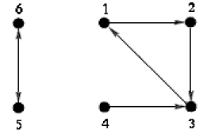

## 문제

Byteotian Intelligence Agency (BIA) employs many spies. Each of them has duty to shadow exactly one other spy.

King Byteasar wants to entrust as many agents as possible with a top secret operation. However, the operation is so important that each spy taking part has to be traced by at least one agent not involved in the operation (assignment of shadowing BIA spies does not change).

Write a programme that:

* reads from standard input the description of whom each spy shadows,
* calculates how many agents can be assigned to the operation in a way that each of them would be spied by at least one agent not taking part in the operation,
* writes the result to the standard output.

## 입력

In the first line of the input there is one positive integer written, n - the number of spies, 2 ≤ n ≤ 1,000,000. The spies are numbered from 1 to n. In the following n lines there is a description of whom each agent spies. Each of these lines contains one positive integer. A number ak situated in line no. k+1 indicates, that the spy no. k shadows the spy no. ak, 1 ≤ k ≤ n, 1 ≤ ak ≤ n, ak≠k.

## 출력

Your programme should write one integer in the first line of the output - the maximal number of spies that can be assigned to the secret operation.

## 힌트

