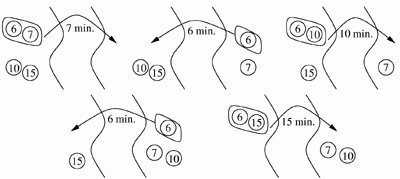

## 문제

In the middle of the night a group of tourists want to cross an old, ruined bridge. They have just one torch. The light of the torch enables two tourists at the most to cross the bridge simultaneously. The tourists cannot cross the bridge without the torch nor in groups larger than two, unless they want to fall into the river. Each tourist requires a certain amount of time to cross the bridge. Two tourists crossing the bridge together need as much time as the slower of them. What is the shortest time, which all of the tourist can cross the bridge in?

Suppose that the group numbers 4 people. The first one of them needs 6 minutes to cross the bridge, the second 7 minutes, the third 10 minutes, the fourth 15 minutes. The following image shows how they can cross the bridge in 44 minutes. However, they can do it faster. How?

A hypothetical method of crossing the bridge in 44 minutes. The numbers in circles denote time (in minutes) required by each tourist to cross the bridge.

Write a programme which:

* reads from the standard input a description of the group of tourists,
* finds the shortest time required to cross the bridge,
* writes the result to the standard output.

## 입력

In the first line of the standard input there is a single positive integer n - the number of tourists, 1 ≤ n ≤ 100,000. In the following n lines there is a non-decreasing sequence of integers not greater than 1,000,000,000, a single number in a line. The number in the (i+1)’st line (1 ≤ i ≤ n) represents the time needed by the i’th tourist to cross the bridge. The sum of these numbers does not exceed 1,000,000,000.

## 출력

Your programme should write to the standard output, in the first line, one integer - the shortest time required for all of the tourist to cross the bridge.
