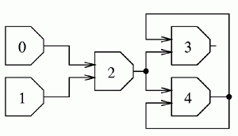

## 문제

Let us consider a circuit consisting of n gates. The gates are numbered from 0 to n-1. Each gate has a certain number of inputs and exactly one output. Each of them (inputs and outputs) may be in either one of the states 0, 1 or 1/2. Each input is connected to exactly one output of some gate. Input's state equals the state of the output it is connected to. Each output may be connected to an arbitrary number of inputs. The gates with numbers 0 and 1 are special - they don't have any input at all while their outputs are always in the following states: 0 for a gate with a number 0, 1 for a gate with a number 1. We say that the state of the output of a gate (in short: gate's state) is valid, if:

1. it equals 0 and the gate has more inputs in state 0 than in state 1.
2. it equals 1/2 and the gate has the same number of inputs in state 0 as in state 1.
3. it equals 1 and the gate has more inputs in state 1 than it has in state 0.
4. the gate is special, i.e. it's number is 0 or 1, and its state is 0 or 1 respectively.

We say that a circuit's state is valid if all the states of its gates are valid. We say that a gate's state is fixed if the gate is in the same state in all circuit's valid states.

Write a programme that:

* reads the circuit's description from the standard input,
* for each gate checks if it's state is fixed, and determines it, if so,
* writes the determined states of gates to the standard output.

## 입력

The first line of the standard input contains the number of gates n, 2 ≤ n ≤ 10,000. The following n-2 lines contain the descriptions of gates' connections - line no. i describes inputs of the gate no. i. There is the number ki of inputs of this gate, followed by ki numbers of gates, ki ≥ 1. Those are the numbers of gates whose outputs are connected to successive inputs of the gate's no. i. Numbers in each line are separated by single spaces. The total number of all inputs of all gates does not exceed 200,000.

## 출력

Your programme should write  lines to the standard output. Depending on the state of gate no. i-1, i’th line should contain:

* 0 - if it is determined and equals 0,
* 1/2 - if it is determined and equals 1/2,
* 1 - if it is determined and equals 1,
* ? (question mark) - if it is not determined.

## 힌트

