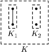
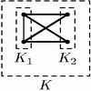

## 문제

C-algae is the Byteotians' favourite dish of their national cuisine. C-algae have a very specific structure. An algae consisting of a single cell is a c-algae. Two c-algae K1 and K2, can be combined in either one of the following ways:

by choosing all the cells from both K1 and K2, and all the connections from both K1 and K2,

by choosing all the cells from both K1 and K2, all the connections from both K1 and K2, and setting further connections: each cell from K1 is connected to every cell from K2.

As a result we obtain a new c-algae K.

Unfortunately the hostile country of Bitotia has recently started selling algae imitating c-algae. These look so alike that it is hard to tell the difference between a false one and a genuine c-algae. This is the reason why the Byteotian government has asked you to write a programme that would allow verification if a given algae is a c-algae.

Write a programme that:

* reads the descriptions of algae from the standard input,
* checks which of them are proper c-algae,
* writes the answer to the standard output.

## 입력

In the first line of the standard input a single integer k is written, 1 ≤ k ≤ 10, it denotes the number of algae to be examined. Descriptions of k algae are written in the following lines. Each single description is of the following form: in the first line there are two integers written, separated by a single space, n and m, 1 ≤ n ≤ 10,000, 0 ≤ m ≤ 100,000. They denote the number of cells and the number of connections respectively. The cells are numbered from 1 to n. In the following m lines the connections are described - each by two integers a, b, separated by a single space (a≠b, 1 ≤ a,b ≤ n), indicating that the cells a and b are connected. Each connection is specified once.

## 출력

k lines should be written to the standard output. In the i’th line one word should be written:

* TAK - (i.e. yes in Polish) - if the i’th algae is a proper c-algae,
* NIE - (i.e. no in Polish) - otherwise.
