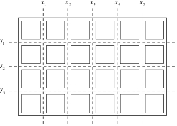

## 문제

We are given a bar of chocolate composed of m x n square pieces. One should break the chocolate into single squares. Parts of the chocolate may be broken along the vertical and horizontal lines as indicated by the broken lines in the picture. A single break of a part of the chocolate along a chosen vertical or horizontal line divides that part into two smaller ones. Each break of a part of the chocolate is charged a cost expressed by a positive integer. This cost does not depend on the size of the part that is being broken but only depends on the line the break goes along. Let us denote the costs of breaking along consecutive vertical lines with x1,x2,…,xm-1 and along horizontal lines with y1,y2,…,yn-1. The cost of breaking the whole bar into single squares is the sum of the successive breaks. One should compute the minimal cost of breaking the whole chocolate into single single squares.  

For example, if we break the chocolate presented in the picture first along the horizontal lines, and next each obtained part along vertical lines then the cost of that breaking will be y1+y2+y3+4⋅(x1+x2+x3+x4+x5).

Write a program which:

* reads the numbers x1,x2,…,xm-1 and y1,y2,…,yn-1,
* computes the minimal cost of breaking the whole chocolate into single squares,
* writes the result.

## 입력

In the first line of the standard input there are two positive integers m and n separated by a single space, 2 ≤ m,n ≤ 1,000. In the successive m-1 lines there are numbers x1,x2,…,xm-1, one per line, 1 ≤ xi ≤ 1,000. In the successive n-1 lines there are numbers y1,y2,…,yn-1, one per line, 1 ≤ yi ≤ 1,000.

## 출력

Your program should write to the standard output. In the first and only line your program should write one integer - the minimal cost of breaking the whole chocolate into single squares.
