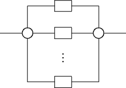

## 문제

The firm of Bytel starts to produce series-parallel electronic circuits. Each such a circuit consists of electronic units, connections between them, and two power connections. A series-parallel circuit may consist of:

a single unit

several smaller series-parallel circuits connected in series

two branching units connecting in parallel several smaller series-parallel circuits.

The circuits are assembled on two-sided printed-circuit boards. The problem is to determine which connections should run on the top and which on the bottom side of the board. For technical reasons as many connections as possible should run on the bottom side but to each unit at least one must come from the top side of the board.

Write a program which:

* reads the description of a series-parallel circuit,
* computes the minimal number of connections that must run on the top side of the board,
* writes the result.

## 입력

From the standard input one should read the description of a series-parallel circuit. The description is in a recursive form:

* if the first line of the description contains a capital letter S and a positive integer n (2 ≤ n ≤ 10,000) separated from each other by a single space, then the circuit being described consists of n smaller circuits connected in series; they are described in the successive lines,
* if the first line of the description contains a capital letter R and a positive integer n (2 ≤ n ≤ 10,000) separated from each other by a single space, then the circuit being described consists of  smaller circuits connected in parallel (by means of two branching units); they are described in the successive lines,
* a line containing only one capital letter X describes a circuit consisting of a single unit only.

The total number of letters X occurring in the description of a circuit does not exceed 10,000,000, and the recursive depth of the description does not exceed 500.

## 출력

Your program should write to the standard output. In the first line there should be one integer equal to the minimal number of connections that must run on the top side of the board.
