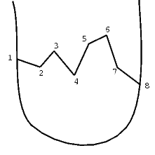
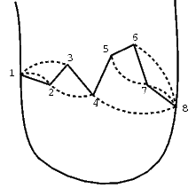

## 문제

Byteotia lies on a peninsula. As far back as from the times of king Bitol railways have been being the basic means of transport in Byteotia. King Bitol has a superspeed railway line built. The line connects eastern and western coasts of the peninsula, runs through all the towns of Byteotia and thus determines their enumeration: the first town on the line has the number 1 and the last has n. The town number 1 lies on the western coast and the town number n lies on the eastern coast.

  
Fig. 1. The Byteotian railway line

Recently, thanks to the minister Byterowicz, the economy of Byteotia has developed very rapidly and the present-day transport network needs to be quickly modernised. King Byteol has given orders for many motorways to be constructed (in the framework of the next 23-year plan). Each of the motorways is to join directly two chosen towns of Byteotia. As each motorway is going to be constructed by a different government agency and on each of the motorways different vignettes are going to be obligatory, it has been decided that the motorways must not cross neither one another nor the railway line. Thus the only solution is to construct each motorway to the north or to the south of the railway line. Figure 2 shows a sample arrangement of motorways (presented as dotted arcs, while the railway line is drawn as the solid line).

  
Fig.2. Sample arrangement of motorways joining towns: 1-2, 1-3, 2-4, 5-7, 4-8, 7-8, 6-8

His Majesty King Byteol has already decided which pairs of towns are to be directly connected by motorways. Your task is to determine which motorways should lie to the north from the railway line, and which to the south. Remember, however, that the motorways must not cross neither one another nor the railway line.

Write a program which:

* reads from the standard input the information on motorways that are planned,
* determines the positions of the motorways (or states that it is not possible to build them according to the given rules),
* writes the result to the standard output.

## 입력

In the first line of the standard input there are two integers: the number of towns n and the number of the planned motorways k, 1 ≤ n,k ≤ 20,000. In the following lines there are pairs of towns which are to be connected by motorways. In the (i+1)-st line there are two integers pi, qi separated by a single space: the numbers of the towns that the i-th motorway is to connect, 1 ≤ pi < qi ≤ n. Pairs of towns are not repeated in the input data.

## 출력

Your program should write to the standard output an arrangement plan of the motorways or a single word NIE ("no" in Polish), if it is not possible to construct all the motorways according to the given rules. If the construction of the motorways is possible then your program should write k lines to the standard output. In the i-th line there should be one capital letter, respectively: N - if the motorway connecting the towns pi and qi should be constructed to the north of the railway line, or S - if to the south of the railway line. If there exist many possible solutions, your program should write only one of them (arbitrary).
