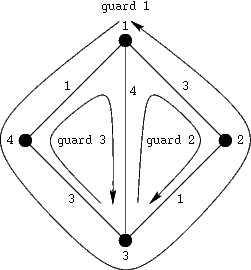

## 문제

King Byteasar had hidden a treasure in his castle, and he kept his hiding place in secret. However, whenever he went to war he was afraid he could die and the treasure would get lost. Therefore he chose trustworthy guards and confided partial information needed to find the treasure to each of them. Next he ordered them to go to the underground vaults that lie under the castle and to walk there using the right-hand rule. The vaults were connected by corridors. The corridors did not cross outside the vaults but they could run under other corridors. There were no corridors leading to the same vault they led off. The right-hand rule stated that a guard after entering a vault left it by the next corridor to the right. The guards were appointed different starting positions at entrances to corridors. It might happen that many guards started from the same vault, unless they were entering the same corridor.

The king knew that until he fell or returned from war all guards would loyally follow his orders. However, he was aware that whenever any two or more guards met in some vault they could not resist sharing all the information they knew about the treasure. The guards were not selfish and they shared information even if some of them would not learnt anything new. If some guards started from the same vault they immediately shared the information they initially knew. If they passed one another in corridors, however, they did not talk.

The king pondered if the treasure would still be secure when he safely returned from war. He wanted to know which guards might obtain all the information needed to find the treasure.

Write a program which:

* reads from the standard input the description of the castle basement, the starting positions of the guards and information each of the guards initially knows,
* determines the guards who could ever know all the information needed to find the treasure,
* writes to the standard output the numbers of those guards.

## 입력

In the first line of the standard input there is one integer n. That is the number of the underground vaults, 2 ≤ n ≤ 100. The vaults are numbered from 1 to n. In the following n lines corridors connecting the vaults are described. In the (i+1)-st line the corridors leading off the i-th vault are described in clockwise order. In each of those lines there are integers separated by single spaces. The first of those numbers, ki, is the number of corridors leading off the i-th vault, 1 ≤ ki ≤ n-1. It is followed, in the same line, by 2ki integers: each leading off corridor is described by two integers. The former is the number of the vault the corridor leads to, and the latter is the length of the corridor: an integer in the range from 1 to 100. The corridors are two-way, i.e. if from a vault a a corridor of length l leads to a vault b then from the vault b a corridor of length l leads to the vault a. Each pair of vaults may be connected by at most one corridor. A guard to walk along a corridor needs exactly the amount of time that is equal to the length of that corridor. We assume the time guards spend in vaults negligible.

In the (n+2)-nd line there are written two integers k and l, 1 ≤ k ≤ 100, 1 ≤ l ≤ 100, where k is the number of guards, and l is the number of pieces of information needed to find the treasure. The guards are numbered from l to k. The pieces of information concerning the treasure are numbered from 1 to l. The guards are described in the following k lines (the i-th guard is described in the (i+n+2)-nd line). Each of those lines consists of integers separated by single spaces. The first integer in a line is the number of the vault the corresponding guard starts from. The second number is the number of the vault the guard goes to first. The third number, mi, is the number of pieces of information concerning the treasure the i-th guard initially knows, 0 ≤ mi ≤ l. The following mi integers in the line are the numbers of the pieces of information initially known to the i-th guard.

## 출력

In the first line of the standard output your program should write one integer: the number of guards who could ever know all the information needed to find the treasure. In the following lines there should be written the numbers of those guards in ascending order, one number per line.

## 힌트

