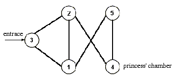

## 문제

Megachip IV the Splendid, the king of Byteotia, intends to give his pretty daughter, princess Ada, away in marriage. He asked her what husband she wanted to have. The princess answered that she expected her future spouse to be wise, and also neither parsimonious nor squandering. The king pondered on what trials the candidates should be put to in order to choose the best one for his daughter. After long musings he found that it would serve best to use a castle he had built for entertainment of the inhabitants of Byteotia. The castle contains a large number of chambers where treasures of the kingdom are gathered. The chambers, connected by corridors, may be visited by the subjects to admire the wonderful things exhibited there. To visit a chamber one has to pay a certain amount of bytealers (a bytealer is a monetary unit of Byteotia). A visit in the castle begins in the entrance chamber.

The king handed a purse to every candidate for a princess' husband. There was the same amount of bytealers in each purse. He asked each candidate to choose his way of visiting some number of the castle's chambers starting from the entrance one and ending in the one the princess stays in. Each candidate was required to spend on his tour exactly the sum that was in his purse. Squanderers that spent too much money on their way did not reach the princess' chamber. On the other hand the parsimonious candidates appeared there with nonempty purses, and the princess sent them away to empty their purses.

Unfortunately, till now no candidate has managed to cope with the king's task, and the princess is still looking forward to her perfect match. Why don't you want to be put to the test? You may write a program that would help the poor princess.

Write a program which:

* reads from the standard input the description of the castle, the number of the chamber the princess stays in, and the sum in the purse,
* calculates the sequence of chambers one should walk through from the entrance one to the princess' one in order to spend exactly the whole contents of the purse,
* writes the found tour to the standard output.

You may assume that for the test data such a tour always exists. If there are more than one such a tour, your program should calculate arbitrary one of them.

## 입력

In the first line of the standard input there are five positive integers n, m, e, p, b, 1 ≤ n ≤ 100, 1 ≤ m ≤ 4950, 1 ≤ e, p ≤ n, 1 ≤ b ≤ 1,000 separated by single spaces. The number n is the number of chambers, and m is the number of corridors. The chambers are numbered from 1 to n. The number e is the number of the entrance chamber, and  is the number of the princess' chamber. The number b is the sum of bytealers in the purse. In the second line there are n positive integers c1,c2,…,cn, 1 ≤ ci ≤ 1,000, separated by single spaces. The number ci is the charge for (each) entering the chamber of number i. In the following m lines there are pairs of positive integers x, y, (x≠y, 1 ≤ x,y ≤ n), one pair per line, the numbers are separated by a single space. Each such a pair states that a corridor connects chambers x and y.

## 출력

Your program should write in the first (and only) line of the standard output a sequence of positive integers separated by single spaces. The sequence denotes the numbers of successive chambers one should visit, starting from the entrance one and ending in the princess' one, to spend exactly the whole contents of his purse.

## 힌트

