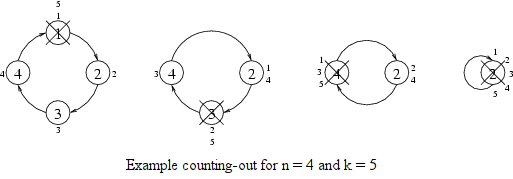

## 문제

Children have gathered in a circle and are playing with a counting-out rhyme. The children are numbered 1 to n so that (for i=1,2,…,n-1) the child number i+1 stands to the left of the child number i, and the child number 1 stands to the left of the child number n. The child who is counted out in the rhyme leaves the circle. The counting out is repeated until there is no one left in the circle. The rules of the play are as follows:

* The first counting is started by the child number 1. Each successive counting is started by the child standing to the left of the child who was last counted out.
* Every time the rhyme consists of k syllables. The child who starts the counting out says the first syllable of the rhyme; the child standing to the left of him or her says the second syllable, the next child says the third one, and so on. The child who says the last syllable of the rhyme is counted out and leaves the circle.

We observe the children playing counting out and we notice the order in which they leave the circle. Basing on this information we try to guess how many syllables the counting-out rhyme consists of.

Write a program which:

* reads from the standard input the description of the order the children left the circle,
* determines the smallest positive number k, for which the children playing with a k-syllable counting-out rhyme would leave the circle in the given order, or states that such a number k does not exist,
* writes to the standard output the determined number k or the word NIE ("no") if such a number k does not exist.

## 입력

In the first line of the standard input there is one positive integer n, 2 ≤ n ≤ 20. In the second line there are n integers separated by single spaces. The i-th number tells at which turn of the counting out the child of number i left the circle.

## 출력

Your program should write in the first and only line of the standard output either one integer: the smallest number k of syllables that the counting-out rhyme can consist of, or one word NIE, if such a number does not exist.
