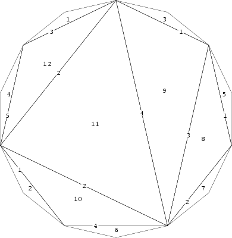

## 문제

On an island of the shape of a convex polygon with 2n sides, there are situated 2n -2 countries. Each country has a territory in the shape of triangle, which vertices are placed at the vertices of the polygon. There are no countries which border exactly with two different countries (therefore, each country borders with only one or three countries). It implies, that there are exactly n countries bordering with one country only (these are seaside countries) and n-2 countries bordering with three neighbours (these are inland countries). Seaside countries are numbered from 1 to n, inland countries have numbers from n+1 to 2n -2. When we travel from one country to another, we are obliged to pay a charge on the border. Charges may be different on different borders, but crossing a border costs the same amount of money in both directions.

For each two countries i, j from n seaside countries, it is known how much one has to pay traveling from i to j, assuming that the land route from one country to the other through the least number of borders was chosen. The task is to find all the charges on the island. For each seaside country there should be given the number of neighbouring country and the charge on the border. Moreover, for each n-2 inland countries there should be given numbers of three neighbouring countries and the charges on borders.

Write a program which:

* reads from the standard input the sums of border charges on routes between seaside countries,
* finds for each country its neighbours,
* computes border charges on the island,
* writes the results to the standard output.

## 입력

In the first line of the standard input there is one positive integer n, 4 ≤ n ≤ 100. This is the number of seaside countries. In each of the following n lines there are n non-negative integers separated by single spaces. The number di,j, on the j-th position in the i-th line, is equal to the sum of border charges on the route (through the least number of borders) from the i-th country to the j-th country. We assume that the charge on each border is an integer from the interval [1,100]. Of course, di,j=dj,i and di,i=0.

## 출력

In each of the first n lines of the standard output there should be written two integers separated by a single space. The first number in the i-th line should be the number of the country, which borders with the country number i. The second number is the charge on the border between these two countries. In each of the following n-2 lines there should be written six integers separated by single spaces. In the line number i, n+1 ≤ i ≤ 2n -1, the first - number of the first country bordering with the i-th country, the second - the charge on their border, the third - number of the second country bordering with the i-th country, the forth - the charge on the second border, the fifth - the number of the third country bordering with the i-th country, the sixth - the charge on the third border. Inland countries are numbered from n+1 to 2n -2.

## 힌트

Sample input corresponds to this picture:

